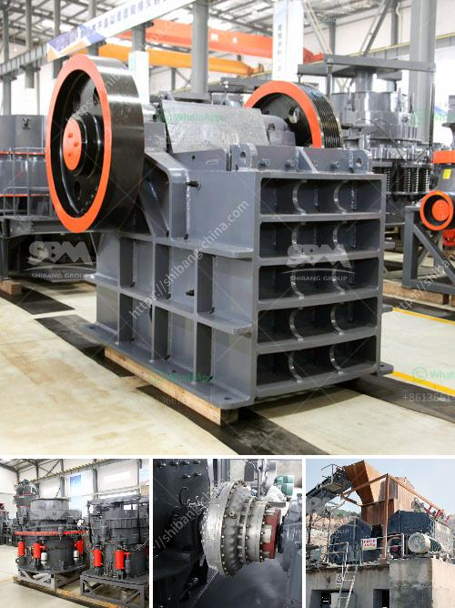

<h3>proppant sand crusher manufacturing process</h3>
Proppant sand, also known as frac sand or hydraulic fracturing sand, is a crucial material used in the extraction of oil and gas through the process of hydraulic fracturing. The demand for proppant sand has been at an all-time high due to the increasing global energy consumption and the development of shale gas and tight oil reservoirs.

The manufacturing of proppant sand involves a complex and multi-stage process that requires careful attention to detail and quality control. This article will provide an overview of the proppant sand crusher manufacturing process.

Firstly, raw materials are carefully selected to ensure that they meet the required specifications. High-quality and durable materials such as silica sand or ceramic beads are commonly used as the primary component of proppant sand. These materials must be sourced from reliable suppliers to guarantee consistency and minimize impurities.

The next step in the manufacturing process is the crushing of the raw materials to the desired particle size. Proppant sand crushers are specially designed machines that reduce the size of the raw materials into fine particles. This crushing process is essential to ensure that the proppant sand has the required strength and conductivity for hydraulic fracturing. Various types of crushers, such as jaw crushers, cone crushers, or impact crushers, can be used depending on the desired final product size and the hardness of the raw materials.

Once the raw materials have been crushed, they undergo an additional process called sintering. Sintering involves subjecting the crushed particles to high temperatures and pressures to bond them together. This step is crucial as it provides the proppant sand with the necessary strength and durability to withstand the extreme conditions of hydraulic fracturing.

After sintering, the proppant sand is then coated with a resin or ceramic material. The coating process helps improve the flowback control and conductivity of the proppant sand, enhancing its performance during hydraulic fracturing operations. Coatings can be applied using various techniques such as fluidized bed coating, spray coating, or multilayer coating systems.

Finally, the coated proppant sand is screened and classified based on its size and shape. Screening ensures that the proppant sand meets the required specifications and eliminates any oversized or undersized particles. Classifying the proppant sand helps to categorize it based on its performance and suitability for different reservoir conditions.

In conclusion, the manufacturing process of proppant sand crushers involves selecting high-quality raw materials, crushing them to the desired particle size, sintering the crushed particles, coating them with resin or ceramic material, and finally screening and classifying the proppant sand. Each step in the process is crucial to ensure that the proppant sand possesses the necessary strength, conductivity, and flow properties required for hydraulic fracturing. The manufacturing process requires precision and adherence to strict quality control measures to meet the increasing demand for proppant sand in the oil and gas industry.
<h3>Contact us</h3><ul><li><strong>Whatsapp:&nbsp;<a href="https://wa.me/8613661969651">+8613661969651</a></strong></li><li><a href="https://swt.shibang-china.com/?git&amp;zhl&amp;proppant sand crusher manufacturing process"><strong>Online Service(chat now)</strong></a></li></ul><h3>Related</h3><ul><li><a href='iron ore crusher price.md'>iron ore crusher price</a></li><li><a href='crushing b series vsi crusher.md'>crushing b series vsi crusher</a></li><li><a href='quartz production process.md'>quartz production process</a></li><li><a href='granite stone hand engraving machine in india.md'>granite stone hand engraving machine in india</a></li><li><a href='talc grinding mills usa.md'>talc grinding mills usa</a></li></ul>