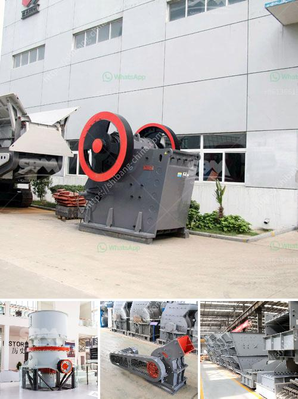

<h3>prototype of a crushing machine</h3>
Crushing machines play a pivotal role in the waste management and recycling industry. They reduce the size of different materials, facilitating the separation and processing of diverse materials for recycling and reusing purposes. The creation of a prototype crushing machine has brought a wave of optimism in this sector, promising increased efficiency and sustainability in waste management. This article will delve into the key features and potential benefits of this innovative crushing machine, emphasizing its significance in sustainable waste management practices.

The prototype crushing machine boasts several remarkable features that set it apart from conventional machinery. Firstly, it is equipped with a powerful motor that enables it to deliver high crushing force, effectively pulverizing even the toughest materials. Additionally, it incorporates a user-friendly interface, allowing operators to adjust settings and control the machine efficiently. The machine's compact design ensures easy transportation and installation at various waste processing plants.

The prototype crushing machine offers numerous advantages to the waste management industry. Firstly, it significantly reduces the volume of waste materials, optimizing storage and transportation costs. By crushing various materials into smaller sizes, it facilitates the efficient separation of recyclable and non-recyclable components. Materials such as concrete, wood, and metal can be repurposed, promoting the concept of a circular economy. Moreover, the prototype crushing machine helps reduce pressure on landfills, which are facing capacity constraints globally.

The prototype crushing machine significantly contributes to sustainable waste management practices by mitigating environmental concerns. By crushing and recycling materials, it reduces the need for raw material extraction and minimizes the energy required for producing new materials. This reduction in energy consumption subsequently lowers greenhouse gas emissions, contributing to the fight against climate change. Furthermore, the machine's efficient waste management capabilities align with global efforts to transition towards a more sustainable, circular economy.

The prototype of a crushing machine promises to revolutionize waste management and recycling practices. With features like a powerful motor, compact design, and user-friendly interface, this innovation enables efficient crushing and separation of waste materials for recycling purposes. The potential benefits of reduced waste volume, optimized storage and transportation, and the promotion of a circular economy cannot be understated. Moreover, the sustainability and environmental impact of this prototype reinforce its significance in the global waste management sector. Incorporating such technological advancements will undoubtedly lead to a more sustainable future, addressing the pressing environmental challenges we face today.
<h3>Contact us</h3><ul><li><strong>Whatsapp:&nbsp;<a href="https://wa.me/8613661969651">+8613661969651</a></strong></li><li><a href="https://swt.shibang-china.com/?git&amp;zhl&amp;prototype of a crushing machine"><strong>Online Service(chat now)</strong></a></li></ul><h3>Related</h3><ul><li><a href='calculation crusher plant cost.md'>calculation crusher plant cost</a></li><li><a href='rubber grinder machine in philippines.md'>rubber grinder machine in philippines</a></li><li><a href='price of crushers of gravel.md'>price of crushers of gravel</a></li><li><a href='cara kerja mesin pemecah batu stone crusher.md'>cara kerja mesin pemecah batu stone crusher</a></li><li><a href='crusher made in taiwan.md'>crusher made in taiwan</a></li></ul>