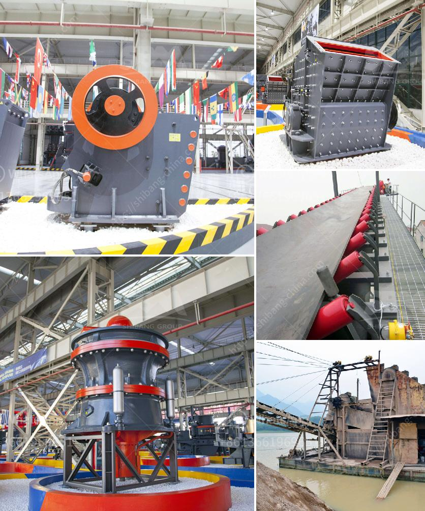

<h3>providers conveyor belts in bolivia</h3>
In today's fast-paced industrial world, efficiency and productivity are key factors for businesses seeking success. Particularly in Bolivia, where industries such as mining, agriculture, and manufacturing form a substantial part of the economy, the importance of efficient material handling cannot be overstated. This is where conveyor belt providers play a pivotal role, offering a range of solutions designed to streamline operations and enhance productivity.

With its diverse natural resources and a strong focus on agriculture and mining, Bolivia relies heavily on the smooth flow of materials within its industries. Conveyor belts provide a reliable and cost-effective method of material handling, ensuring products, raw materials, and resources are transported efficiently, minimizing manual labor and reducing downtime.

a. Increased Productivity: Conveyor belts enable the continuous movement of materials, reducing the need for manual handling and allowing for a consistent workflow. This results in improved productivity, reduced labor costs, and potential increases in production output.

b. Enhanced Safety: Conveyor belts are built with safety features, such as emergency stops and safety sensors, to prevent accidents, injuries, and material damage. By reducing manual handling, workers are less exposed to physical strain and hazardous conditions.

c. Versatile Applications: Conveyor belts are adaptable to various industries, including mining, agriculture, food processing, and manufacturing. They can handle a wide range of products, from bulk materials like ore, grains, and coal to smaller items such as automotive components or packaged goods.

d. Cost Efficiency: Conveyor belts provide cost savings by reducing labor costs, eliminating product loss or damage, and optimizing production processes. These savings compound over time and contribute to the overall profitability of businesses.

There are several conveyor belt providers in Bolivia that cater to the diverse needs of different industries. Some notable providers include:

a. Empresa Boliviana de Caminos (EBC): EBC offers comprehensive conveyor belt solutions and consultancy services, utilizing state-of-the-art technology to meet industry-specific requirements. They specialize in bulk material handling solutions for mining and construction industries.

b. Tecnigoma Industrial: A leading provider of conveyor belt systems, Tecnigoma Industrial offers a wide range of products, including heavy-duty and lightweight belts, suitable for various industrial applications.

c. SIBELT Conveyor Belts: With a focus on agricultural and industrial conveyor belts, SIBELT provides customized solutions for different sectors, including agriculture, tobacco, and manufacturing.

Conveyor belt providers in Bolivia play a crucial role in enhancing efficient material handling across industries. By offering reliable, cost-effective, and versatile solutions, these providers enable companies to optimize their operational processes, improve productivity, and ensure worker safety. As Bolivia continues to develop, investing in conveyor belt systems will be instrumental in supporting the growth and success of its industries.
<h3>Contact us</h3><ul><li><strong>Whatsapp:&nbsp;<a href="https://wa.me/8613661969651">+8613661969651</a></strong></li><li><a href="https://swt.shibang-china.com/?git&amp;zhl&amp;providers conveyor belts in bolivia"><strong>Online Service(chat now)</strong></a></li></ul><h3>Related</h3><ul><li><a href='bauxite beneficiation process.md'>bauxite beneficiation process</a></li><li><a href='stone crushers in south africa.md'>stone crushers in south africa</a></li><li><a href='crush calcite equipment.md'>crush calcite equipment</a></li><li><a href='marcasite ball mill.md'>marcasite ball mill</a></li><li><a href='stone quarrying stone crusher.md'>stone quarrying stone crusher</a></li></ul>