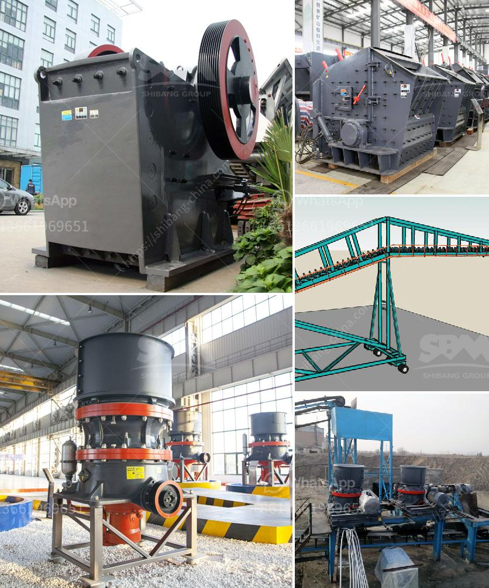

<h3>pulverizer machine dealers in cuttack</h3>
Pulverizer machines have become an essential part of various industries, including food processing, pharmaceutical, chemical, and mining. They are widely used for grinding, crushing, and pulverizing different materials into fine powders or granules. In Cuttack, a bustling city in the state of Odisha, several dealers and suppliers offer a wide range of pulverizer machines to cater to the diverse needs of local businesses.

One of the leading pulverizer machine dealers in Cuttack is located in the heart of the city's industrial hub. This dealer specializes in supplying high-quality machines from renowned manufacturers, ensuring maximum customer satisfaction. They offer a wide variety of pulverizer machines, including impact pulverizers, micro pulverizers, and ultra-fine pulverizers, among others. These machines are designed to handle different types of materials, such as spices, grains, herbs, and minerals, with varying degrees of hardness.

The dealer's range of pulverizer machines is known for its excellent performance, durability, and energy efficiency. These machines are equipped with advanced features that enhance their productivity and reduce operational costs. For instance, some models come with automatic feeding systems, allowing operators to handle large quantities of materials effortlessly. Additionally, modern pulverizer machines are designed with safety features to protect operators from potential accidents or injuries.

Apart from supplying pulverizer machines, dealers in Cuttack also provide comprehensive after-sales services to their customers. These services include installation, maintenance, and repair, ensuring that the machines operate at their optimal efficiency. Skilled technicians are readily available to handle any technical issues, minimizing downtime and maximizing productivity for businesses relying on pulverizer machines for their operations.

Customers can expect personalized assistance from the dealers, who possess in-depth knowledge about the various pulverizer models and their applications. They understand the unique requirements of different industries and can recommend the most suitable machine for specific processing needs. Moreover, these dealers maintain transparent pricing policies, ensuring fair and competitive prices for their products and services.

To maximize customer convenience, many pulverizer machine dealers in Cuttack offer flexible payment options, including cash, credit, and installment plans. This allows businesses with tight budgets to invest in these essential machines without straining their finances. Moreover, these dealers often maintain a ready stock of popular pulverizer models, ensuring prompt delivery and minimizing waiting time for customers.

In Cuttack's dynamic industrial landscape, the presence of reliable and reputable pulverizer machine dealers is invaluable. These dealers play a crucial role in supporting the growth and success of local businesses by providing them with efficient and reliable pulverizer machines. Whether it is a small-scale food processing unit or a large-scale manufacturing plant, these machines enable businesses to enhance their production capabilities, improve product quality, and meet the ever-increasing market demand.

In conclusion, pulverizer machine dealers in Cuttack offer a wide range of high-quality machines that cater to the diverse needs of industries in the region. With their expertise and comprehensive after-sales services, these dealers ensure efficient and reliable operations for businesses relying on pulverizer machines. By investing in these essential machineries, local businesses can stay competitive, boost profitability, and contribute to the overall economic progress of Cuttack.
<h3>Contact us</h3><ul><li><strong>Whatsapp:&nbsp;<a href="https://wa.me/8613661969651">+8613661969651</a></strong></li><li><a href="https://swt.shibang-china.com/?git&amp;zhl&amp;pulverizer machine dealers in cuttack"><strong>Online Service(chat now)</strong></a></li></ul><h3>Related</h3><ul><li><a href='china stone crusher closed circuit.md'>china stone crusher closed circuit</a></li><li><a href='how to make ganpati with marble powdee.md'>how to make ganpati with marble powdee</a></li><li><a href='uses of stone crusher equipment pdf.md'>uses of stone crusher equipment pdf</a></li><li><a href='limestone process plant.md'>limestone process plant</a></li><li><a href='5mm limestones grinding to powder.md'>5mm limestones grinding to powder</a></li></ul>