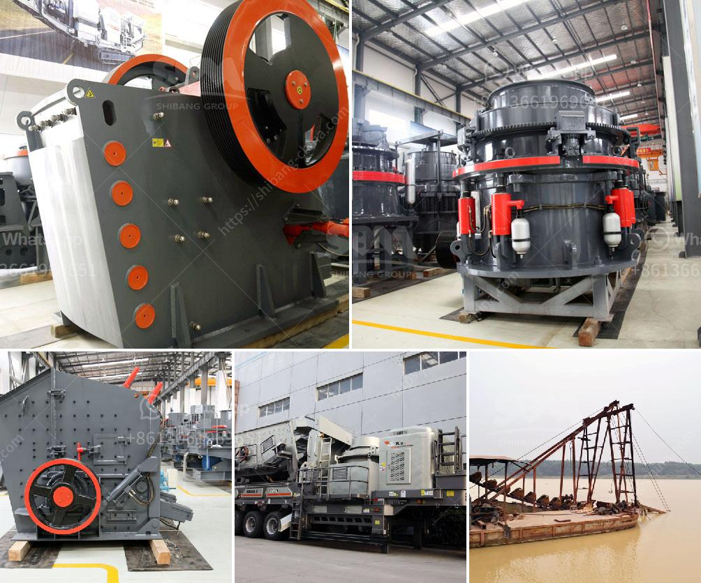

<h3>purity chura crushing machine</h3>
Coconut oil has gained immense popularity in recent years due to its numerous health benefits and versatile usage in cooking, skincare, and haircare. To meet the growing demand for this remarkable product, the coconut industry constantly strives to improve its manufacturing practices. With this intention, a game-changing invention has emerged, shaking up the traditional chura (dried coconut kernel) crushing process. The Purity Chura Crushing Machine revolutionizes coconut oil production, promising higher efficiency, superior quality, and increased yield.

Traditionally, the chura crushing process involves manual labor and time-consuming methods. Coconut kernels are removed from the shell and dried for extended periods. Once dried, they are manually crushed using heavy tools or ground into powder using stone grinders. Unfortunately, this method possesses several limitations, particularly in terms of hygiene, consistency, and productivity.

The Purity Chura Crushing Machine, however, changes the game entirely. It is a mechanical device specifically designed to streamline the chura crushing process. This cutting-edge machine boasts several innovative features that ensure greater efficiency and a significant reduction in processing time.

One of the standout features of the Purity Chura Crushing Machine is its high-speed crushing mechanism. Equipped with sharp blades, it effortlessly shreds the chura into a fine powder in a matter of minutes. This speed not only saves precious time for manufacturers but also ensures consistency in particle size, leading to a superior-quality end product.

Another advantage of this fantastic machine is its state-of-the-art design, incorporating hygiene principles. The entire crushing process takes place in a fully enclosed chamber, eliminating contaminants and providing a clean and safe environment. This not only enhances the quality of the coconut oil but also reduces the risk of microbial contamination, extending its shelf life and improving consumer confidence.

In addition to its efficiency and hygienic advantages, the Purity Chura Crushing Machine boasts a notable increase in yield. By evenly crushing the chura, it extracts a significantly higher quantity of coconut oil compared to traditional methods. This improved yield not only maximizes profit for manufacturers but also ensures a consistent supply of high-quality coconut oil for consumers.

Moreover, this cutting-edge machine is also eco-friendly. The Purity Chura Crushing Machine consumes minimal energy, contributing to sustainability efforts and reducing the carbon footprint of the coconut oil manufacturing process.

As the demand for coconut oil continues to grow, it becomes paramount for manufacturers to embrace innovative technologies to meet consumer expectations effectively. The Purity Chura Crushing Machine sets a new standard in coconut oil production by providing higher efficiency, unparalleled quality, increased yield, and eco-friendliness.

With its remarkable features and benefits, the Purity Chura Crushing Machine is proving to be a game-changer in the coconut industry. Manufacturers can now provide a consistent supply of premium coconut oil while significantly reducing production time and costs. Additionally, consumers can enjoy the assurance of purchasing a high-quality, hygienic product that conforms to the latest industry standards.

In conclusion, the Purity Chura Crushing Machine is an outstanding addition to the coconut oil manufacturing process. Its groundbreaking design and features bring multiple advantages, making it an essential tool for coconut farmers and oil producers alike. With this remarkable device, coconut oil production enters a new era, promising enhanced productivity, product quality, and consumer satisfaction.
<h3>Contact us</h3><ul><li><strong>Whatsapp:&nbsp;<a href="https://wa.me/8613661969651">+8613661969651</a></strong></li><li><a href="https://swt.shibang-china.com/?git&amp;zhl&amp;purity chura crushing machine"><strong>Online Service(chat now)</strong></a></li></ul><h3>Related</h3><ul><li><a href='roller mill calcium.md'>roller mill calcium</a></li><li><a href='granite processing plant.md'>granite processing plant</a></li><li><a href='concrete will crusher for sale in uae.md'>concrete will crusher for sale in uae</a></li><li><a href='old impact crushing plant for sale.md'>old impact crushing plant for sale</a></li><li><a href='copper crusher exporter in south africa.md'>copper crusher exporter in south africa</a></li></ul>