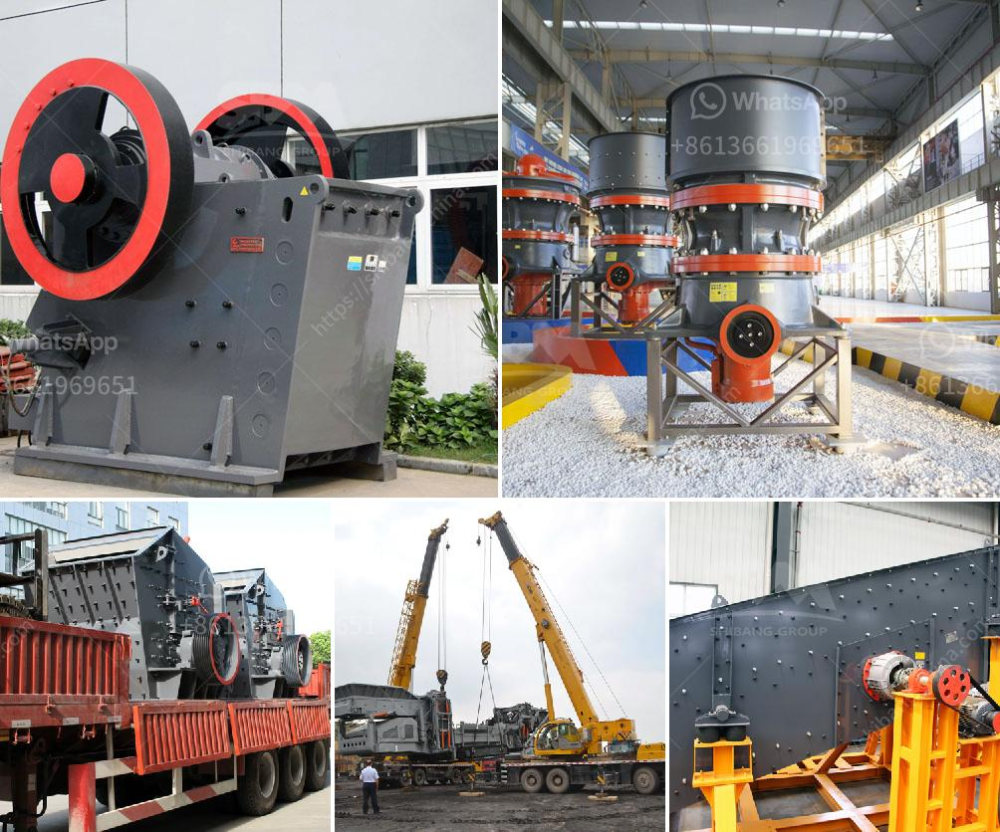

<h3>puzzolana lime stone crushing plant</h3>
Limestone is a common mineral that forms sedimentary rocks. Most limestone is composed of calcium carbonate, which is the main component of marine organisms like coral and mollusks. Limestone has various uses, including as a building material, as aggregate for the base of roads, as white pigment or filler in products such as toothpaste or paints, and as a chemical feedstock.

To meet the growing demand for limestone in various industries, efficient processing is required. Puzzolana Machinery Fabricators, a leading player in the crushing and screening industry, offers innovative and highly efficient crushing solutions for limestone processing. Their puzzolana lime stone crushing plants are built for high performance, productivity, and durability.

One of the notable features of Puzzolana's crushing plants is its versatility. Ideal for crushing different types of materials such as limestone, granite, and basalt, Puzzolana machinery can be customized to meet the specific requirements of customers. This flexibility ensures that the crushing plant is perfectly suited for any application, whether it is for road construction, aggregate production, or industrial purposes.

Puzzolana lime stone crushing plants are designed with advanced technology, ensuring efficient and reliable operation. A combination of jaw crushers, cone crushers, and vertical shaft impactors (VSI) is used in these plants. Jaw crushers are used to crush large rocks into smaller pieces, while cone crushers provide secondary and tertiary crushing. VSI crushers produce high-quality cubical aggregates, which are the preferred choice for concrete production.

The plants are equipped with robust and durable components, ensuring long-term operation with minimum maintenance. Additionally, Puzzolana plants are designed to be energy efficient, reducing energy consumption and operating costs. The crushers have advanced automation features, allowing precise control of the crushing process. This results in consistent product quality and higher production rates.

Another advantage of Puzzolana's lime stone crushing plants is their mobility. The plants can be easily transported to different sites, making them ideal for construction projects with varying locations. Quick and hassle-free installation is another feature of these plants. This provides significant time and cost savings for customers.

Puzzolana's commitment to customer satisfaction is evident in their comprehensive after-sales service support. Their team of qualified engineers is available for assistance and maintenance, ensuring uninterrupted operation of the crushing plants. Puzzolana also offers genuine spare parts and components, eliminating the risk of using inferior quality replacements.

In conclusion, Puzzolana lime stone crushing plants offer innovative and efficient solutions for limestone processing. With their versatility, durability, and advanced technology, these plants ensure high-quality aggregates for various applications. The mobility and easy installation features make them a preferred choice for construction projects. Puzzolana's commitment to customer satisfaction through their after-sales service support further enhances the value proposition. For any limestone crushing requirements, Puzzolana is the brand to trust.
<h3>Contact us</h3><ul><li><strong>Whatsapp:&nbsp;<a href="https://wa.me/8613661969651">+8613661969651</a></strong></li><li><a href="https://swt.shibang-china.com/?git&amp;zhl&amp;puzzolana lime stone crushing plant"><strong>Online Service(chat now)</strong></a></li></ul><h3>Related</h3><ul><li><a href='rubber conveyor belt pdf.md'>rubber conveyor belt pdf</a></li><li><a href='small scale verticle grinding limestone machine.md'>small scale verticle grinding limestone machine</a></li><li><a href='tonne stone crusher price for hire in cardiff.md'>tonne stone crusher price for hire in cardiff</a></li><li><a href='model project of stone powder.md'>model project of stone powder</a></li><li><a href='harga mobile crusher in indonesia.md'>harga mobile crusher in indonesia</a></li></ul>