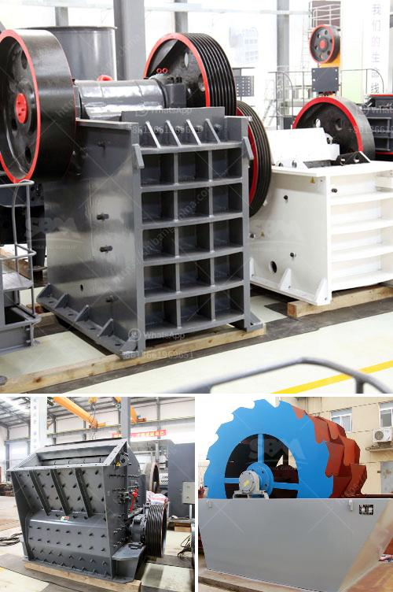

<h3>quarry and stone crushing executive business plan</h3>
Quarry is a major sector in the construction industry, it makes Granite a a fundamental product in building construction. From time immemorial using granite stone for construction have been the order of the day,it remains a core product in construction. Nigeria is blessed with this essential solid mineral which makes it profitable for anyone to own a quarry .The country is richly endowed with granite stone and other related solid minerals like Marble, Dolomite and Basalt etc.

It is found in Enugu, Ebonyi, Kogi, Plateau, Ogun, Oyo, Osun and Ekiti etc. Hence, granite is among the most available and affordable building material. Nigeria been a country located in the tropics has these rocks in commercial quantity and it is a means of livelihood for many in some parts of the country.

In the past, it was mined manually, but now there are sophisticated equipment that make quarrying very easy. Lagos as a cosmopolitan city developing by the day cannot do without granite. The market is stratified into three, including large scale, medium and small scale . Lagos state is producing million tons of granite per annum ,serving most of the Lagos area with the most expensive housing infrastructure .

These various aggregates are used in the production of asphalt for road and bridge construction, buildings, and other similar infrastructure. The business is characterised by:

• Massive deposit of granite stones coupled with the explosive growth in the construction industry.

• A supply chain comprising of various interdependent components such as quarry, mining and stone crushing.

• Market expansion beyond corporate and commercial buildings to residential building and remodeling markets.

With this business plan, we will shoulder on supplying local governments and private builders with the best and price competing building/aggregates for their respective projects.
<h3>Contact us</h3><ul><li><strong>Whatsapp:&nbsp;<a href="https://wa.me/8613661969651">+8613661969651</a></strong></li><li><a href="https://swt.shibang-china.com/?git&amp;zhl&amp;quarry and stone crushing executive business plan"><strong>Online Service(chat now)</strong></a></li></ul><h3>Related</h3><ul><li><a href='ball mills china.md'>ball mills china</a></li><li><a href='used crushing machine price.md'>used crushing machine price</a></li><li><a href='mini mobile crusher.md'>mini mobile crusher</a></li><li><a href='crushing production line in equipment.md'>crushing production line in equipment</a></li><li><a href='millia deasel grinding mill and prices.md'>millia deasel grinding mill and prices</a></li></ul>