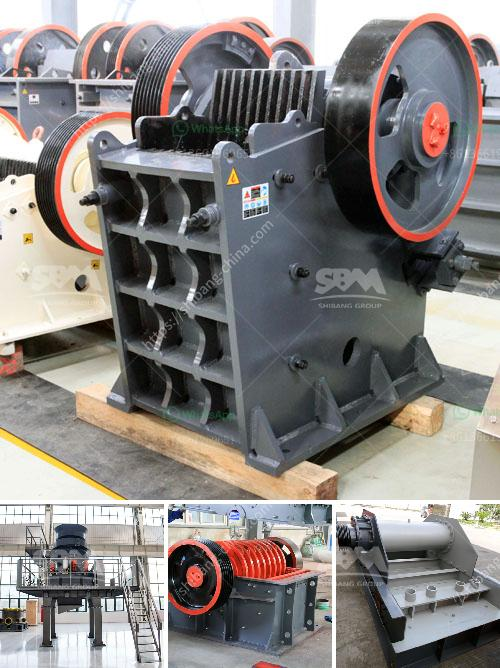

<h3>quarry crusher equipment manufacturer in turkey</h3>
Quarrying is a highly demanding industry that requires a unique set of equipment, tools, and machinery. Turkey is a country rich in natural resources such as rocks and minerals, making it an ideal location to set up a quarry. However, to effectively extract these valuable resources, quarry crusher equipment is necessary.

Quarry crusher equipment plays a vital role in the extraction process, as the crusher is responsible for reducing the size and shaping of the rocks. This process ensures a consistent end product that can be used for construction, infrastructure, and other industries. Turkey is home to several manufacturers of quarry crusher equipment, making it a competitive market.

One of the leading crusher equipment manufacturers in Turkey is FABO Machinery. They have been providing high-quality quarry crushers for years. FABO Machinery not only designs and manufactures quarry crusher equipment but also provides comprehensive aftersales service, including installation, maintenance, and spare parts. This ensures that their customers can rely on their equipment for years to come.

Another prominent manufacturer in Turkey is General Machinery. With a focus on innovation and customer satisfaction, General Machinery offers a wide range of quarry crushers suitable for various applications. Their products are known for their durability, efficiency, and optimal performance. General Machinery also offers consultancy services to help their customers choose the most suitable equipment for their specific needs.

In addition to FABO Machinery and General Machinery, Turkey is home to several other quarry crusher equipment manufacturers, each with their own unique offerings. This abundance of manufacturers ensures a competitive market that benefits the customers by providing them with a wide range of choices.

Overall, the quarry crusher equipment manufacturers in Turkey are committed to producing high-quality products and providing excellent customer service. With their reliable equipment, the extraction process becomes more efficient and cost-effective, resulting in higher productivity and profitability for quarry operators. Whether it is for large-scale industrial projects or small residential construction, the quarry crusher equipment manufacturers in Turkey have the solutions to meet the demands of this challenging industry.
<h3>Contact us</h3><ul><li><strong>Whatsapp:&nbsp;<a href="https://wa.me/8613661969651">+8613661969651</a></strong></li><li><a href="https://swt.shibang-china.com/?git&amp;zhl&amp;quarry crusher equipment manufacturer in turkey"><strong>Online Service(chat now)</strong></a></li></ul><h3>Related</h3><ul><li><a href='distributors of conveyor belts in malaysia.md'>distributors of conveyor belts in malaysia</a></li><li><a href='crusher and screen plant for sale japan.md'>crusher and screen plant for sale japan</a></li><li><a href='industrial roller mills.md'>industrial roller mills</a></li><li><a href='industrial mill crusher price.md'>industrial mill crusher price</a></li><li><a href='jaw crusher in china.md'>jaw crusher in china</a></li></ul>