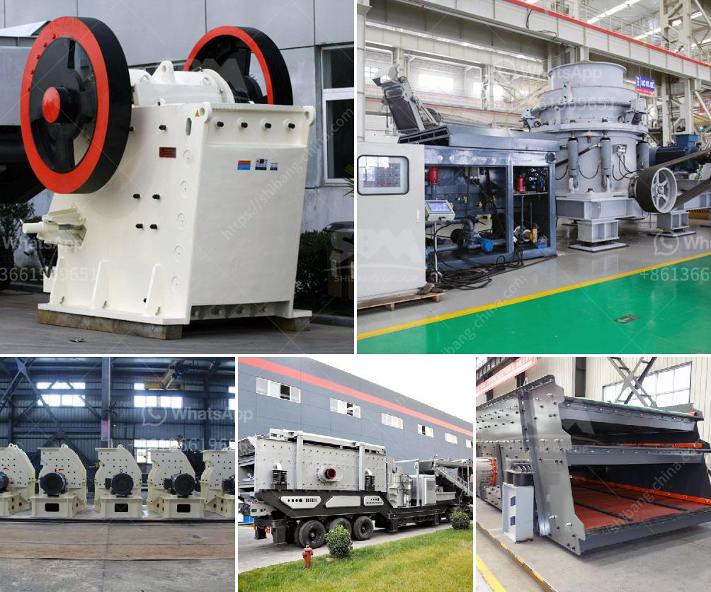

<h3>quarry crusher in kenya</h3>
Earlier crushing machines were handmade tools consisting of cowhides and wooden handles, but now with advancements in technology, quarry crushers have taken the market by storm. The quarry crusher, often referred to as a stone crusher, is an essential piece of equipment for the construction industry. This machine is indispensable in breaking down large rocks into smaller-sized pieces for further use.

In Kenya, quarry crushers are an integral part of the construction industry as they help to transform large rocks into small stones. These machines are important in creating building materials like concrete, paving stones, and crusher dust. Quarry crushers are particularly useful in road and highway construction projects as crushed stones of various sizes are necessary for the construction process.

One of the reasons quarry crushers are highly sought after in Kenya is their ability to crush various types of stones efficiently. From granite to limestone, these machines can handle a wide range of materials. The crusher utilizes strong blades or hammers to break down rocks into smaller pieces. The crushed stones are then used for multiple purposes, such as road bases, asphalt manufacturing, and building foundations.

Another advantage of quarry crushers in Kenya is their mobility. These machines can be easily transported from one site to another, allowing contractors to set up temporary quarries wherever needed. This flexibility reduces transportation costs and enables efficient and timely completion of construction projects.

Furthermore, quarry crushers are equipped with advanced features that aid in improved productivity and safety. Modern crushers are equipped with automatic control systems that monitor and adjust the performance parameters, optimizing the crushing process. Additionally, safety features such as a magnetic separator and dust suppression systems help ensure a safe working environment for operators.

In conclusion, quarry crushers play a vital role in Kenya's construction industry. Their ability to crush and transform large rocks into smaller, manageable pieces makes them an invaluable tool for construction projects. With their versatility, mobility, and advanced features, quarry crushers have revolutionized the crushing industry in Kenya, making construction processes more efficient and cost-effective. As the demand for building materials continues to rise, quarry crushers will continue to be an essential component in Kenya's construction landscape.
<h3>Contact us</h3><ul><li><strong>Whatsapp:&nbsp;<a href="https://wa.me/8613661969651">+8613661969651</a></strong></li><li><a href="https://swt.shibang-china.com/?git&amp;zhl&amp;quarry crusher in kenya"><strong>Online Service(chat now)</strong></a></li></ul><h3>Related</h3><ul><li><a href='ball mill for silica powder.md'>ball mill for silica powder</a></li><li><a href='china stone crusher pe 400 specs.md'>china stone crusher pe 400 specs</a></li><li><a href='stone crusher machine 100 cm.md'>stone crusher machine 100 cm</a></li><li><a href='coal crusher machine indonesia supplier.md'>coal crusher machine indonesia supplier</a></li><li><a href='cone crusher dimension specification.md'>cone crusher dimension specification</a></li></ul>