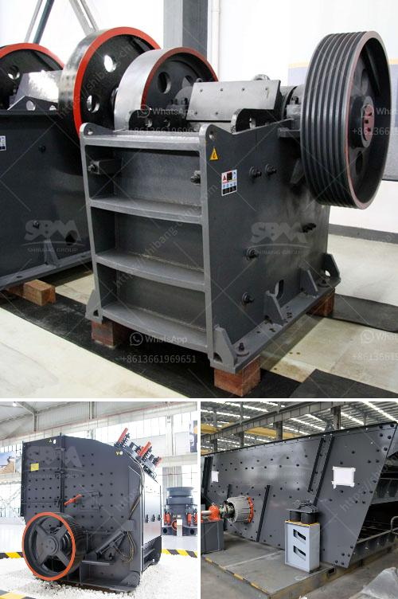

<h3>quarry crusher rules</h3>
Quarries play a vital role in the construction industry by providing raw materials that are essential for building and infrastructure projects. However, it is crucial to implement certain rules and regulations to ensure the safety and efficiency of operations. Quarry crusher rules serve as guidelines for quarry owners, employees, and visitors to maintain a safe and productive environment.

First and foremost, one of the primary rules for quarry crushers is to comply with all applicable local, state, and federal laws regarding safety, health, and environmental regulations. This includes obtaining the necessary permits, licenses, and authorizations to operate the quarry legally.

Secondly, proper safety measures must be in place to prevent accidents and incidents. Quarry owners should ensure that all crushers and equipment are properly maintained and regularly inspected. Employees should be trained on safe operating procedures, including the proper use of protective gear, lockout/tagout procedures, and emergency protocols.

In addition, it is essential to establish clear rules regarding the transportation of materials within the quarry. This includes defining designated routes and speed limits for trucks and vehicles to prevent collisions and injuries.

Another crucial rule is to strictly monitor and control noise and dust emissions. Quarries often involve crushing, drilling, and blasting activities, which can generate high levels of noise and dust. Implementing measures such as noise barriers, dust suppression systems, and regular monitoring can help mitigate these environmental impacts.

Furthermore, quarry owners should have a clear policy regarding waste management. This includes proper disposal and recycling of materials, such as concrete, asphalt, and construction waste.

Lastly, regular inspections and audits should be conducted to ensure compliance with the established rules. This helps identify any potential hazards or areas for improvement and ensures that the quarry operates in line with the best practices of the industry.

In conclusion, quarry crusher rules are essential for promoting safe and sustainable quarrying operations. By adhering to these rules, quarry owners can protect the well-being of their employees, minimize environmental impacts, and maintain a positive reputation within the construction industry.
<h3>Contact us</h3><ul><li><strong>Whatsapp:&nbsp;<a href="https://wa.me/8613661969651">+8613661969651</a></strong></li><li><a href="https://swt.shibang-china.com/?git&amp;zhl&amp;quarry crusher rules"><strong>Online Service(chat now)</strong></a></li></ul><h3>Related</h3><ul><li><a href='chrome washing plant new technology.md'>chrome washing plant new technology</a></li><li><a href='small rock crusher machine.md'>small rock crusher machine</a></li><li><a href='jaw crusher manganese.md'>jaw crusher manganese</a></li><li><a href='industrial rotary dryers for sale india.md'>industrial rotary dryers for sale india</a></li><li><a href='small stone crushers for sale.md'>small stone crushers for sale</a></li></ul>