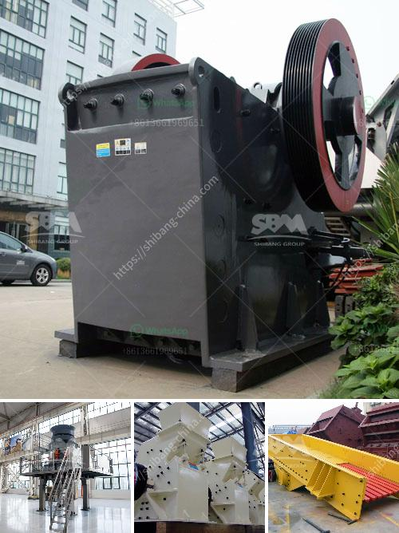

<h3>quarry crusher supplier</h3>
In the mining and quarrying industry, the primary purpose of a quarry crusher is to break rocks into smaller pieces of rock size, referred to as aggregates. With progress in technology, quarry crushers have evolved to offer different power sources, ease of use, and control systems, making it easier for businesses to transport, set up, and operate such machines. One critical aspect for achieving optimum productivity in quarrying operations is choosing the right quarry crusher supplier.

A reliable quarry crusher supplier understands the importance of providing high-quality equipment that not only enhances productivity but also ensures the safety of working personnel and the environment. They are knowledgeable about the various types of quarry crushers available in the market and can recommend the most suitable options based on your specific requirements and budget.

When selecting a quarry crusher supplier, it is crucial to consider their experience and track record in the industry. A supplier with a long history of providing reliable equipment to quarrying businesses is likely to be more dependable. Their experience enables them to understand the unique challenges faced in the field and to offer customized solutions that meet the needs of their clients.

Another vital factor to assess is the quality of the quarry crushers provided by the supplier. The durability and efficiency of these machines directly impact the overall productivity of your quarry operations. A reputable supplier will collaborate with renowned manufacturers who adhere to stringent quality control measures. They will offer crushers made from durable materials and designed to withstand demanding quarry environments.

Efficiency is a key consideration in any quarry operation, as it directly influences the profitability of the business. A reputable quarry crusher supplier will provide equipment that is designed for maximum efficiency, minimizing downtime and optimizing production rates. Modern technologies, such as automation and remote monitoring, can enhance the operational efficiency of the crushers, allowing for real-time data tracking and preventive maintenance schedules.

Furthermore, a reliable quarry crusher supplier will also offer support services that extend beyond the initial equipment purchase. They will provide training programs for your operational staff to ensure they understand the proper operation and maintenance requirements of the machines. Additionally, they will offer technical assistance and on-site servicing to address any issues that may arise during the lifespan of the equipment.

In conclusion, choosing the right quarry crusher supplier is paramount for enhancing the efficiency and productivity of your quarry operations. A supplier with a solid track record, quality equipment, and a commitment to ongoing support can help you achieve your goals in the most cost-effective manner. Take the time to research and compare different suppliers, ensuring they have the necessary experience, expertise, and resources to meet your specific needs. By investing in a reliable and reputable supplier, you can drive your quarry operations towards greater success and profitability.
<h3>Contact us</h3><ul><li><strong>Whatsapp:&nbsp;<a href="https://wa.me/8613661969651">+8613661969651</a></strong></li><li><a href="https://swt.shibang-china.com/?git&amp;zhl&amp;quarry crusher supplier"><strong>Online Service(chat now)</strong></a></li></ul><h3>Related</h3><ul><li><a href='coal screening process.md'>coal screening process</a></li><li><a href='crusher for rent in malaysia.md'>crusher for rent in malaysia</a></li><li><a href='30t hr 50t hr range stone crusher plant china.md'>30t hr 50t hr range stone crusher plant china</a></li><li><a href='coal pulverizer crusher manufacturers.md'>coal pulverizer crusher manufacturers</a></li><li><a href='conveyor belt supplier in riyadh.md'>conveyor belt supplier in riyadh</a></li></ul>