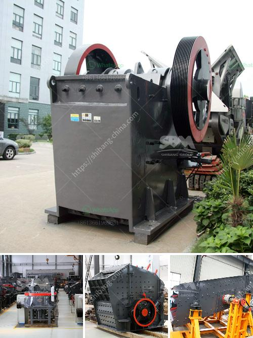

<h3>quarry dust in concrete sand making stone quarry</h3>
Quarry dust is a byproduct of the crushing process which is a concentrated material to use as aggregates for concreting purpose, especially as fine aggregates. Quarry dust can be used as a substitute for sand to improve the properties of concrete.

Quarry dust is a byproduct of the crushing process which is a concentrated material to use as aggregates for concreting purpose, especially as fine aggregates. Quarry dust can be used as a substitute for sand to improve the properties of concrete. Quarry dust is becoming increasingly popular in construction projects as a replacement for sand due to several reasons.

Firstly, quarry dust has a higher density compared to sand and could help in improving the strength of concrete when added with other aggregates. The increased density of quarry dust helps in creating a strong bond between the particles and the mortar, thus resulting in improved overall strength of the concrete.

Secondly, quarry dust can help in reducing the shrinkage of concrete when compared to sand. Shrinkage occurs when water is lost from the concrete during the drying process, leading to a decrease in volume. By using quarry dust as a replacement for sand in concrete, the amount of water required for mixing is significantly reduced. This reduces the overall shrinkage of the concrete and helps in preventing cracks and deformations.

Thirdly, quarry dust is cost-effective compared to sand. Quarry dust is a waste material obtained from stone quarries and will be disposed of if not utilized. By using quarry dust, the demand for sand can be reduced and the surplus can be utilized for other construction purposes. This not only helps in reducing the cost of construction but also helps in reducing the environmental impact caused by the disposal of quarry dust.

Furthermore, the use of quarry dust in concrete also helps in reducing the environmental impact caused by the extraction of sand from riverbeds. Sand extraction from rivers has been causing several environmental issues like reduction of water storage capacity, erosion of river banks, and depletion of groundwater. By using quarry dust as a substitute for sand, the demand for sand from riverbeds can be reduced, thus helping in preserving the natural resources and preventing environmental degradation.

It is important to note that the use of quarry dust in concrete should be done carefully and in the right proportions. Excessive use of quarry dust can lead to a decrease in the workability of concrete and affect its overall performance. Therefore, it is recommended to consult with a civil engineer or a concrete specialist before using quarry dust as a substitute for sand in concrete.

In conclusion, quarry dust can be a viable substitute for sand in concrete, helping to improve its properties and reducing the environmental impact caused by sand extraction. It is an efficient and cost-effective option that should be considered in construction projects. However, proper evaluation and testing should be done to determine the appropriate proportion of quarry dust to be used in concrete for the desired results.
<h3>Contact us</h3><ul><li><strong>Whatsapp:&nbsp;<a href="https://wa.me/8613661969651">+8613661969651</a></strong></li><li><a href="https://swt.shibang-china.com/?git&amp;zhl&amp;quarry dust in concrete sand making stone quarry"><strong>Online Service(chat now)</strong></a></li></ul><h3>Related</h3><ul><li><a href='dubai dolomite crusher suppliers.md'>dubai dolomite crusher suppliers</a></li><li><a href='manufacturer of quartz powder in karnataka.md'>manufacturer of quartz powder in karnataka</a></li><li><a href='how to set up a crushing plant.md'>how to set up a crushing plant</a></li><li><a href='roller crusher brick making machine.md'>roller crusher brick making machine</a></li><li><a href='clinker grinding mill machine germany.md'>clinker grinding mill machine germany</a></li></ul>