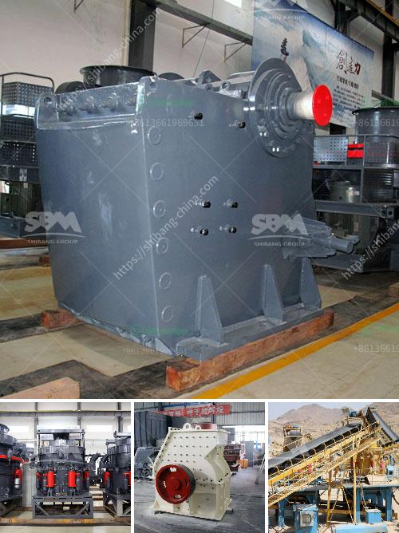

<h3>quarry equipment for railway</h3>
The development of railways has played a significant role in the advancement of transportation systems globally. Whether for commuting purposes or transporting goods, railways provide a cost-effective, safe, and environmentally friendly alternative to other modes of transportation. However, the successful establishment and maintenance of a railway network require meticulous planning and effective execution, especially when it comes to quarry equipment. Quarry equipment plays a vital role in the construction of railway tracks and ensuring their efficient operation. Let's delve into the various types of quarry equipment used and their benefits in railway projects.

One of the primary quarry equipment used in railway projects is the rock drilling machine. Whether it's for drilling boreholes, fractures, or rock fissures, rock drilling machines are crucial in preparing the foundation for railway tracks. These powerful machines use pneumatic, electric, or hydraulic drilling technologies to create holes of various sizes and depths. Rock drilling machines not only increase the productivity of the construction site but also ensure precision and accuracy in drilling, which is essential for the stability and longevity of the railway tracks.

Another essential quarry equipment for the railway industry is the stone crusher. Used in various stages of railway construction, the stone crusher amplifies the efforts of workers by reducing the large boulders and rocks into smaller, manageable sizes. This enables easier transportation and laying of the crushed stones, which are an integral part of the railway track bed. The stone crusher also helps in minimizing dust emissions, noise pollution, and environmental impact, making it a sustainable choice for railway construction projects.

Additionally, loaders and haulers are indispensable quarry equipment used in railway construction. Loaders assist in the loading and transportation of materials, such as crushed stones, sand, and gravel, necessary for building rail tracks. These powerful machines not only reduce the time and physical effort required but also ensure the efficient distribution of materials across the construction site. Haulers, on the other hand, are responsible for transporting large quantities of heavy materials, such as stones and aggregates, over long distances efficiently. This capability enables a smooth and uninterrupted supply of construction materials required for the railway project.

Efficiency and safety are critical considerations in railway projects. Quarry equipment, such as excavators, come into play to ensure enhanced performance and safety. Excavators remove unwanted debris and earth from the construction site, creating a stable foundation for railway tracks. These versatile machines offer many attachments that aid in the timely completion of the project, such as the grabber, breaker, or bucket. Excavators are designed with advanced safety features to protect workers by reducing accidents, such as rollovers, and enhance overall project safety.

In conclusion, the success of railway projects heavily relies on the efficient and safe use of quarry equipment. From drilling machines to stone crushers, loaders, and excavators, these machines play a crucial role in preparing the construction site, transporting materials, and ensuring the stability and longevity of railway tracks. The efficient utilization of quarry equipment not only enhances productivity but also reduces environmental impact and enhances worker safety. Therefore, investing in high-quality quarry equipment is essential for the successful completion of railway projects, leading to an improved transportation network globally.
<h3>Contact us</h3><ul><li><strong>Whatsapp:&nbsp;<a href="https://wa.me/8613661969651">+8613661969651</a></strong></li><li><a href="https://swt.shibang-china.com/?git&amp;zhl&amp;quarry equipment for railway"><strong>Online Service(chat now)</strong></a></li></ul><h3>Related</h3><ul><li><a href='mining equipment suppliers in south korea.md'>mining equipment suppliers in south korea</a></li><li><a href='grinding plant improvement.md'>grinding plant improvement</a></li><li><a href='sand making machine saudi.md'>sand making machine saudi</a></li><li><a href='prices of industrial mills prices of crushing plant.md'>prices of industrial mills prices of crushing plant</a></li><li><a href='harga jaw crusher x.md'>harga jaw crusher x</a></li></ul>