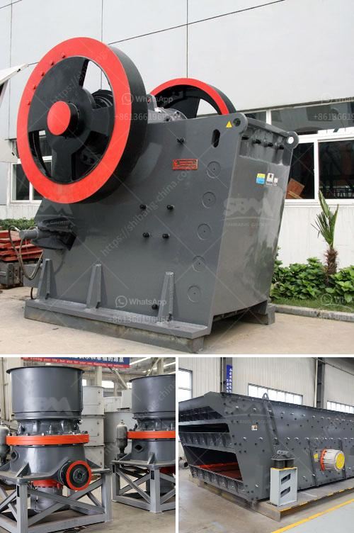

<h3>quarry equipment for sale in china</h3>
Quarrying entails the extraction of rocks and other materials from the earth's surface. This process often requires highly specialized equipment to facilitate the quarrying operations, and it is in China that one can find some of the most impressive selection of quarry equipment. As the world's largest producer of building materials, China has a thriving quarry equipment manufacturing industry.

China's quarry equipment industry is particularly renowned for its advanced technology and cutting-edge machinery. It constantly invests in research and development to improve the efficiency, productivity, and safety of quarrying operations. This has made Chinese quarry equipment highly sought after across the globe.

One can find a plethora of quarry equipment for sale in China, including crushers, conveyors, stackers, reclaimers, excavators, loaders, bulldozers, and more. These machines are designed to handle various types of rocks and minerals with different hardness levels. For instance, crushers are used to break down larger rocks into smaller, more manageable sizes. Excavators and loaders are then employed to transport these materials within the quarry site.

What sets Chinese quarry equipment apart is its durability and reliability. Manufacturers in China understand the harsh conditions in which these machines operate and ensure they are built to withstand extreme environments. Additionally, they adhere to strict quality control measures to meet international standards, ensuring that the machinery meets the needs of quarry owners worldwide.

Furthermore, Chinese quarry equipment manufacturers also provide comprehensive after-sales services. This includes technical support, spare parts availability, and assistance with installation and training. This ensures that quarry owners can rely on their equipment for years to come, increasing their operational efficiency and minimizing downtime.

In conclusion, China is a leading destination for quarry equipment for sale. Its advanced technology, extensive range of equipment, and focus on quality make it an attractive option for quarry owners worldwide. Investing in Chinese quarry equipment can significantly enhance the productivity and profitability of quarrying operations.
<h3>Contact us</h3><ul><li><strong>Whatsapp:&nbsp;<a href="https://wa.me/8613661969651">+8613661969651</a></strong></li><li><a href="https://swt.shibang-china.com/?git&amp;zhl&amp;quarry equipment for sale in china"><strong>Online Service(chat now)</strong></a></li></ul><h3>Related</h3><ul><li><a href='barite grinding plants.md'>barite grinding plants</a></li><li><a href='stone crushing equipment.md'>stone crushing equipment</a></li><li><a href='crusher crusher run for sale in sabah.md'>crusher crusher run for sale in sabah</a></li><li><a href='crusher unit manufacturer india.md'>crusher unit manufacturer india</a></li><li><a href='hammer crusher in china.md'>hammer crusher in china</a></li></ul>