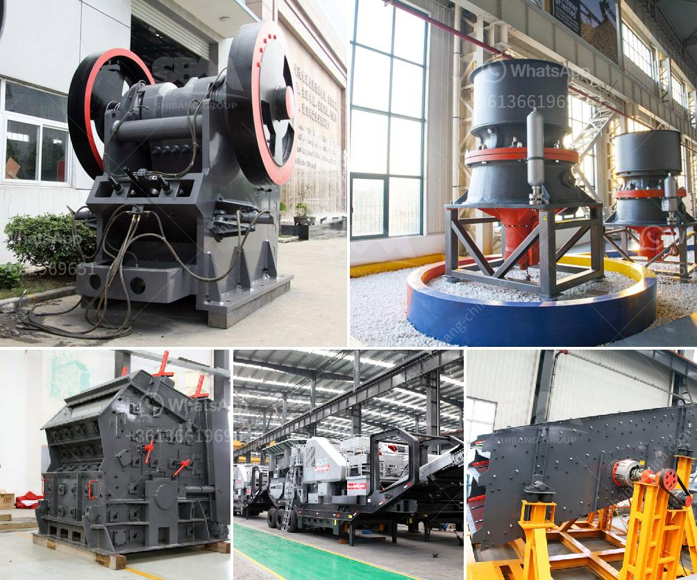

<h3>quarry plant solutions</h3>
Quarrying is an essential process in the mining industry that involves extracting raw materials from the earth's surface. This process is necessary for the production of various construction materials, such as aggregate, crushed stone, and sand. To support such demanding operations, quarry plant solutions have become increasingly vital.

Quarry plant solutions encompass a range of equipment and machinery specifically designed to optimize efficiency and productivity in the quarrying process. These solutions address various challenges and operational requirements typically encountered in quarrying operations.

One crucial aspect of quarry plant solutions is the extraction and processing of raw materials. Quarry plants are equipped with heavy machinery, including excavators, loaders, crushers, and conveyor belts, to extract and transport extracted materials efficiently. These machines work together seamlessly to ensure a continuous flow of raw materials from the quarry face to the processing area.

In recent years, technological advancements have revolutionized quarry plant solutions, significantly improving productivity and reducing environmental impact. For instance, advanced computerized systems are now used to monitor and control quarry operations remotely. This technology allows operators to track the performance of extraction equipment, optimize production rates, and identify any potential issues or bottlenecks in real-time.

Another key aspect of quarry plant solutions is the processing of raw materials. In the processing area, crushers, screens, and washing equipment are used to reduce the size of extracted materials and convert them into various products for construction purposes. These machines are designed to handle enormous amounts of materials efficiently, ensuring a consistent supply of high-quality products.

Moreover, environmental considerations play a crucial role in modern quarry plant solutions. To mitigate the impact on the surrounding ecosystem, various measures are implemented. Dust control systems are employed to minimize respiratory health risks for workers and maintain air quality in local communities. Additionally, water management systems are implemented to minimize water consumption and control discharge, reducing the ecological impact on nearby water bodies.

Furthermore, quarry plant solutions incorporate energy-efficient technologies to minimize the carbon footprint associated with quarrying operations. Equipment is designed to consume less energy while maintaining high levels of productivity. This energy-efficient approach not only reduces operational costs but also contributes to a more sustainable mining industry.

In conclusion, quarry plant solutions play a vital role in maximizing efficiency and productivity in the quarrying process. These solutions integrate advanced technologies, heavy machinery, and environmentally sustainable practices to meet the demanding requirements of the mining industry. From the extraction of raw materials to the processing and delivery of finished products, quarry plant solutions optimize every step of the process, ensuring reliable supplies of construction materials while minimizing environmental impact. As the demand for construction materials continues to rise, the effective implementation of quarry plant solutions becomes increasingly critical for a sustainable and efficient quarrying industry.
<h3>Contact us</h3><ul><li><strong>Whatsapp:&nbsp;<a href="https://wa.me/8613661969651">+8613661969651</a></strong></li><li><a href="https://swt.shibang-china.com/?git&amp;zhl&amp;quarry plant solutions"><strong>Online Service(chat now)</strong></a></li></ul><h3>Related</h3><ul><li><a href='rubber conveyor belt pdf.md'>rubber conveyor belt pdf</a></li><li><a href='buy fine grinding machine.md'>buy fine grinding machine</a></li><li><a href='stone crushers in south africa.md'>stone crushers in south africa</a></li><li><a href='50 tph raymond mills.md'>50 tph raymond mills</a></li><li><a href='second hand diesel hammer mill for sale south africa.md'>second hand diesel hammer mill for sale south africa</a></li></ul>