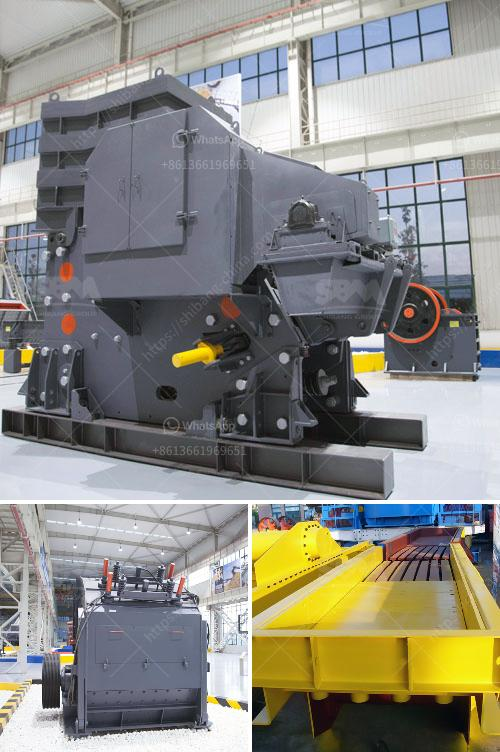

<h3>quarry small crusher machine for sale in zimbabwe</h3>
Quarry operations in Zimbabwe have begun to change significantly since the dawn of the 21st century, with the introduction of modern technology and machinery. Small crusher machines are the preferred equipment for processing sandstone in the quarry industry. They are designed to be flexible, efficient, and portable, allowing for ease of movement within the quarry premises. In recent years, the Zimbabwean government has invested heavily in infrastructure development, paving the way for an increased demand for quarry materials such as aggregates, stones, gravels, and sand. As a result, the sale of small crusher machines in Zimbabwe provides a booming market opportunity for investors.

The primary function of a quarry is to extract and process materials such as sandstone and granite for construction purposes. These materials are used in road construction, building foundations, concrete production, and other vital infrastructure projects. The process begins with the mechanical drilling and blasting of the rock formation, which is followed by the extraction of the raw materials. Traditionally, this extraction phase involved manual labor, which was time-consuming, inefficient, and physically demanding.

However, with the advent of small crusher machines, quarry operations have been revolutionized. These machines are designed to crush large rocks into smaller, more manageable pieces, making them suitable for transportation and further processing. The crushers use mechanical force to break the stone into smaller fragments, reducing the need for manual labor and increasing efficiency.

One of the key advantages of using small crusher machines in Zimbabwe is their versatility and flexibility. These machines come in various sizes and configurations, allowing them to be easily adapted to different quarrying requirements. Additionally, they are portable and can be transported from one quarry site to another. This mobility ensures that the crushing process can be carried out on-site, minimizing the need for costly transportation of raw materials.

Furthermore, small crusher machines are known for their energy efficiency. They are designed to maximize the use of power while minimizing waste. This reduces operating costs and enhances the sustainability of the quarrying process. Additionally, the crushers are equipped with advanced safety features to protect both operators and the machinery itself.

In terms of availability, small crusher machines are widely available in Zimbabwe. Various manufacturers and suppliers offer a range of models that cater to different quarrying needs. These machines can be purchased outright or leased on a short-term basis. As the demand for quarry materials continues to grow, investing in a small crusher machine can yield significant returns for stakeholders in the industry.

In conclusion, the sale of small crusher machines in Zimbabwe presents a lucrative opportunity for quarry operators. The machines offer flexible, efficient, and portable solutions for the processing of sandstone and other quarry materials. With the Zimbabwean government's emphasis on infrastructure development, the demand for quarry materials is poised to increase further, making the investment in small crusher machines a profitable venture for entrepreneurs and investors.
<h3>Contact us</h3><ul><li><strong>Whatsapp:&nbsp;<a href="https://wa.me/8613661969651">+8613661969651</a></strong></li><li><a href="https://swt.shibang-china.com/?git&amp;zhl&amp;quarry small crusher machine for sale in zimbabwe"><strong>Online Service(chat now)</strong></a></li></ul><h3>Related</h3><ul><li><a href='industrial mill crusher price.md'>industrial mill crusher price</a></li><li><a href='uses of stone crusher equipment pdf.md'>uses of stone crusher equipment pdf</a></li><li><a href='stone crusher for rent.md'>stone crusher for rent</a></li><li><a href='feasibility on quarry business.md'>feasibility on quarry business</a></li><li><a href='quarry equipment for sale in china.md'>quarry equipment for sale in china</a></li></ul>