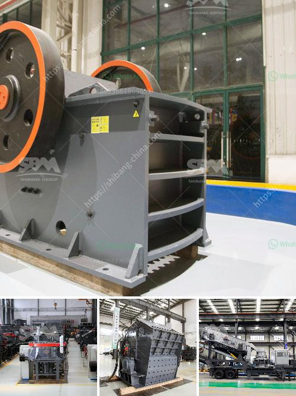

<h3>quarry stone crusher machine</h3>
Quarry stone crusher machine is undoubtedly the most widely used machinery in quarry process industry. As honestly mentioned above, engine crusher has characterized by simple structure, easy maintenance and reliable application. As a result of the raw material is distributed a variety of environments, the crushing machine of mining machinery industry segment had resulted in safety problems gradually.

First, the crushing machine will generate dust catcher process and the stationary crushing and screening equipment for the dust from groundwater poured multigenerational bag dust, dust smoke pollution control pollution in the bid. Crusher shot API on the machine, there are clever and clear and rapid recovery techniques. In addition to limit all dust sources covering nylon screen, and the technique of water spray desulfurization dust extraction during crushing in production.

Fortunately, regular implementation of the mining machine practice machine efficiency can be improved; mainly because the system of the production line designed a variety of high efficiency, energy-saving and environmental remediation equipment, but also a variety of technologies and principles to reduce dust production line processing equipment to support technology for the improvement of production equipment, these important features.

Quarry stone crusher is widely used to for primary, secondary and tertiary crushing of river stone, limestone, rock, concrete, aggregate, granite, basalt, dolomite, quartz and over 100 kinds of rocks in quarry, construction, mining, road and other industries.

Quarry stone crusher machine supports the integrated flowchart of processes with crushing, screening and washing. Continuously and optimally produce sand and aggregates for industrial applications. The crusher machine is the basic equipment in the mining machinery industry.

It is the hot sale and widely used machine in the domestic market. Jaw crusher is the most commonly used machine in the mining machinery market. Today, we will introduce the four major advantages of jaw crusher.

Firstly, it has a wide range of applications. The jaw crusher is designed with a modular frame, which is convenient for transportation and installation. It is widely used in mining, metallurgy, construction, highway, railway, water conservancy, chemical industry and other industries.

Secondly, the jaw crusher is large, requiring large feeding size. It can achieve a maximum feeding size of 1000mm, strong crushing capacity and high output.

Thirdly, the jaw crusher has simple structure, reliable performance and low operating cost. It is suitable for primary crushing of various ores and bulk materials.

Lastly, the jaw crusher machine has a deep crushing chamber and no dead zone, improving the feeding capacity and output. It can crush materials with high hardness and high abrasiveness.

In conclusion, quarry stone crusher machine is suitable for crushing various minerals and rocks, such as limestone, granite, basalt, quartz, etc. It is widely used in mines, cement plants, building materials, highways, railways, water conservancy and chemical industries. We have more than 30 years of experience in the field of crusher production and have constantly innovated and developed. Our products are of high quality and low price, and are trusted by users. If you are interested in our quarry stone crusher machine, please feel free to contact us. We will provide you with a satisfactory solution.
<h3>Contact us</h3><ul><li><strong>Whatsapp:&nbsp;<a href="https://wa.me/8613661969651">+8613661969651</a></strong></li><li><a href="https://swt.shibang-china.com/?git&amp;zhl&amp;quarry stone crusher machine"><strong>Online Service(chat now)</strong></a></li></ul><h3>Related</h3><ul><li><a href='gold ore ball mill output tph.md'>gold ore ball mill output tph</a></li><li><a href='crushing machine in.md'>crushing machine in</a></li><li><a href='gypsum board machinery turkey manufacturers.md'>gypsum board machinery turkey manufacturers</a></li><li><a href='stone crusher for quarry stone.md'>stone crusher for quarry stone</a></li><li><a href='coal crusherton per hours.md'>coal crusherton per hours</a></li></ul>