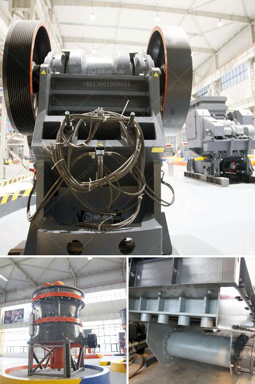

<h3>quarry stone crusherequipment</h3>
Quarry stone crusher equipment is a combination of feeding device, crusher device, conveying device, screening device and power system. As a result of the great development of the basic construction and the reconstruction of the towns and the rapid rise of the high-rise buildings, the old-style buildings die out, and the waste of the construction wastes is directly buried without treatment, Then it will cause long-lasting harm to our life, forcing us to arrive at a solution - reuse of construction waste resources. 

Although China's construction waste in the "waste" part is not high, about 30%, but it does not mean that the concentrated emissions of construction waste is simple and harmless, in the problem of construction waste emission and treatment of outstanding, "constructing a resource-conserving and environment-friendly society," the call is getting higher and higher, in Qingdao, so that two-thirds of construction waste need to be transported to the suburbs to landfill, the usual direct fill approach could not solve the pollution problem. 

Today, quarry stone crusher equipment has made a great contribution to the improvement of construction waste treatment technology. The appearance of quarry stone crusher equipment has effectively improved the quality of construction waste disposal. Stone crusher equipment can be divided into quartz crusher, limestone crusher, marble crusher, granite crusher, according to the chemical properties. Accordint to the capacity and the specific gravity of the mine materials, the installation of stone crusher equipment is also divided into different models. It is widely used in many fields including mining, smelting, building materials, roads, railways, water conservancy and chemical industries. 

In the process of using stone crusher equipment, please take good care of the equipment to avoid unnecessary losses. It is necessary to lubricate the equipment regularly, otherwise the internal parts may wear out. It is necessary to clean the equipment regularly to ensure the normal operation of the machine and prolong its service life. In addition, special attention should be paid to the maintenance of the bearings. If the bearings are damaged, they should be replaced in time to avoid abnormal damage to the equipment. By doing a good job in the regular maintenance and maintenance of the equipment, it can ensure that there is no abnormality in the operation of the equipment, reduce the wear and tear of the internal parts, and extend the service life of the equipment.
<h3>Contact us</h3><ul><li><strong>Whatsapp:&nbsp;<a href="https://wa.me/8613661969651">+8613661969651</a></strong></li><li><a href="https://swt.shibang-china.com/?git&amp;zhl&amp;quarry stone crusherequipment"><strong>Online Service(chat now)</strong></a></li></ul><h3>Related</h3><ul><li><a href='mini mobile crusher.md'>mini mobile crusher</a></li><li><a href='hammer mill grinder for sale in dubai.md'>hammer mill grinder for sale in dubai</a></li><li><a href='calcium carbonate manufacturing process.md'>calcium carbonate manufacturing process</a></li><li><a href='clinker grinding mill machine germany.md'>clinker grinding mill machine germany</a></li><li><a href='cement factory plant cost.md'>cement factory plant cost</a></li></ul>