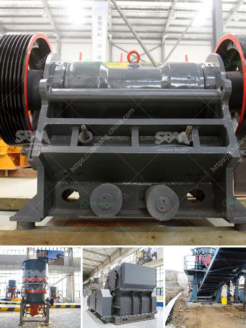

<h3>quarry stone dressing machine</h3>
The implementation of stone dressing machines in the quarrying industry has significantly improved both the speed and efficiency of extracting stone blocks from quarries. The stone dressing machine represents an essential piece of equipment for any quarry stone manufacturer as it streamlines the entire stone extraction process. This versatile machine has revolutionized the industry by allowing quarry workers to extract stones of various sizes in a minimal amount of time.

One of the primary benefits of using a stone dressing machine is its ability to cut stones into specific sizes and shapes. This machine has different cutting and shaping tools that can be adjusted to meet the specific requirements of various projects. Whether the stones are needed for building walls, paving roads, or creating sculptures, the stone dressing machine can effortlessly shape and cut the stones to the desired specifications.

The stone dressing machine is equipped with robust blades that allow it to cut through tough granite, limestone, and sandstone materials. The power and sharpness of the blades ensure a seamless cutting process, minimizing the risk of damage to the stones. Additionally, the machine's advanced cutting mechanism reduces the time spent on stone extraction, thereby increasing productivity in the quarry.

In addition to its cutting capabilities, the stone dressing machine also possesses unique shaping tools that enhance its versatility. These tools enable the machine to create intricate designs and contours on the stones, giving them a polished and refined appearance. Whether it's creating elegant curves or crisp edges, the stone dressing machine can transform raw stones into aesthetically pleasing finished products.

The stone dressing machine's efficiency is further enhanced by its user-friendly design. Operators can easily manipulate the machine's controls and adjust its settings to suit different stone extraction requirements. Its ease of use ensures that even workers with limited experience can quickly adapt to operating the machine, minimizing the need for extensive training.

Furthermore, the stone dressing machine incorporates safety features that prioritize worker well-being. The machine's automatic shut-off system ensures that in the event of a malfunction or when the operator is in danger, the machine stops immediately, preventing any potential accidents. Additionally, the machine is equipped with noise and dust reduction mechanisms, promoting a safer and healthier working environment.

The application of quarry stone dressing machines has greatly benefitted stone manufacturers by increasing their productivity, improving the quality of their products, and ensuring the safety of their workers. This versatile equipment has revolutionized the quarrying industry, enabling operators to meet the ever-growing demand for stone products promptly.

In conclusion, the stone dressing machine serves as an invaluable tool in the quarrying industry. Its ability to cut and shape stones with precision and speed significantly optimizes the stone extraction process. With its user-friendly design and safety features, the stone dressing machine provides a cost-effective solution for quarry companies looking to enhance their operations.
<h3>Contact us</h3><ul><li><strong>Whatsapp:&nbsp;<a href="https://wa.me/8613661969651">+8613661969651</a></strong></li><li><a href="https://swt.shibang-china.com/?git&amp;zhl&amp;quarry stone dressing machine"><strong>Online Service(chat now)</strong></a></li></ul><h3>Related</h3><ul><li><a href='mica powder mill equipment supplier.md'>mica powder mill equipment supplier</a></li><li><a href='quarry stone crusherequipment.md'>quarry stone crusherequipment</a></li><li><a href='crusher price of nigeria.md'>crusher price of nigeria</a></li><li><a href='second hand jaw crusher for sale in malaysia.md'>second hand jaw crusher for sale in malaysia</a></li><li><a href='gravel conveyors and scales for sale.md'>gravel conveyors and scales for sale</a></li></ul>