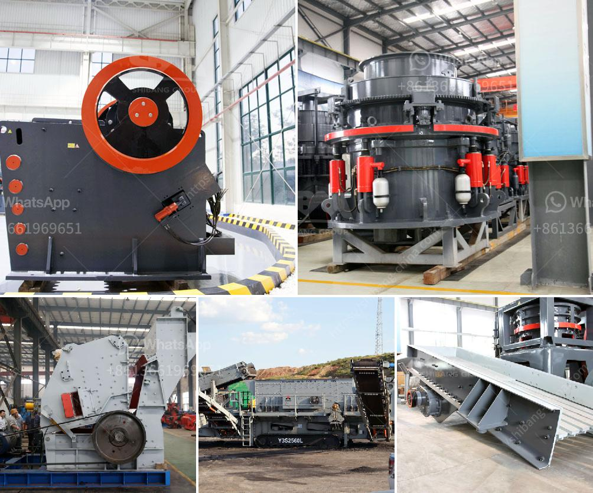

<h3>quarrying business plant in nigeria</h3>
Nigeria has abundant mineral resources, including natural gas, coal, bauxite, tantalite, gold, tin, iron ore, limestone, niobium, lead, and zinc. Despite huge deposits of these natural resources, the mining industry in Nigeria is still in its infancy. Manufacturing, oil, and gas dominate the extractive sector in Nigeria. However, the Nigerian government is making efforts to diversify the economy and exploit the potential of the mining industry, particularly through quarrying.

Quarrying in Nigeria is a significant segment of mining, which involves extracting solid minerals like limestone, granite, and gravel. These quarries are typically found close to major construction projects like roads, real estate, and infrastructure development, making them essential for the country's economic growth.

One of the largest quarrying companies in Nigeria is Crushed Rock Industries Limited. This company is a pioneer quarrying firm that specializes in producing and supplying building and construction materials. Crushed Rock Industries operates multiple quarries and plants in Ebonyi State, Nigeria, serving as a leading supplier of all sizes of crushed stones and related materials for civil engineering projects in the area.

The quarrying plant operated by Crushed Rock Industries is equipped with modern and sophisticated mining machines, which facilitate the extraction of high-quality stones. These machines include drilling equipment, blasting machines, crushers, and screening equipment. They allow the company to meet the growing demands of its customers within strict timeframes.

The quarrying process begins with site preparation, where experts conduct geological surveys to determine the quality and quantity of the mineral deposit. Once the site is deemed suitable, the drilling team begins work, creating holes by using powerful hydraulic drills. Explosives are then inserted into these holes, and controlled blasts loosen the rocks in the quarry. After the blasting, excavators load the stones onto dump trucks, which transport the materials to the designated processing area within the plant.

At the processing plant, the extracted stones are sorted and crushed into various sizes using crushers, ensuring that the resulting aggregates meet the required specifications. To guarantee quality, Crushed Rock Industries uses modern screening equipment to separate the aggregates into different grades for various construction purposes. These grades are used in the production of asphalt, road bases, building foundations, and construction works. The Aggregates are finally loaded into trucks and distributed to customers.

The quarrying business in Nigeria provides significant employment opportunities for the local population. Quarry workers, truck drivers, technicians, engineers, and other professionals work together to ensure a smooth operation. This not only contributes to poverty alleviation but also promotes skill development and economic growth.

As Nigeria continues to experience rapid urbanization and infrastructural development, the demand for construction materials is increasing. Quarrying plants, like Crushed Rock Industries, play a crucial role in meeting this demand and supporting the nation's development objectives. However, the potential of the quarrying industry in Nigeria is still largely untapped. To encourage investments in this sector, the Nigerian government needs to provide necessary infrastructure, improve the legal framework, and create an enabling business environment.

In conclusion, the quarrying business plant in Nigeria is a lucrative opportunity for entrepreneurs and investors. With vast mineral resources available, skilled labor, and the support of the government, the sector shows great potential for growth. By focusing on modern mining techniques, sustainable practices, and infrastructure development, Nigeria can accelerate the growth of its quarrying industry and reap the benefits of its rich mineral resources.
<h3>Contact us</h3><ul><li><strong>Whatsapp:&nbsp;<a href="https://wa.me/8613661969651">+8613661969651</a></strong></li><li><a href="https://swt.shibang-china.com/?git&amp;zhl&amp;quarrying business plant in nigeria"><strong>Online Service(chat now)</strong></a></li></ul><h3>Related</h3><ul><li><a href='cone crusher dimension specification.md'>cone crusher dimension specification</a></li><li><a href='start up granite quarry crusher business.md'>start up granite quarry crusher business</a></li><li><a href='stone crusher project report.md'>stone crusher project report</a></li><li><a href='china vertical roller mill.md'>china vertical roller mill</a></li><li><a href='quote for sand making machine.md'>quote for sand making machine</a></li></ul>