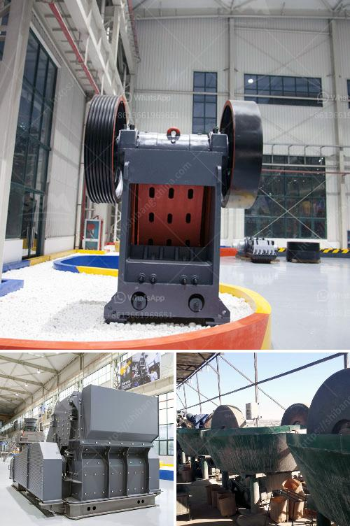

<h3>quartz ball mill</h3>
Quartz ball mill is a specialized equipment developed on the basis of traditional ball mill combined with the features of quartz ore. It can be effectively used for processing quartz sand with high purity, particle size and chemical stability. It is an essential equipment in the production line of quartz processing.

The quartz ball mill is mainly composed of feeding device, discharge device, rotating device, transmission device (reducer, pinion gear, motor, electronic control), etc. The hollow shaft is made of steel castings and the lining can be removed and replaced. The grinding media can be steel balls, ceramic balls or natural pebbles. The grinding medium cylinders inside the ball mill continuously crush the quartz particles, resulting in a finer product.

Quartz ball mills have been widely used in various applications in both the mining industry and the construction industry. It is used for grinding minerals, limestone, clinker, cement, slag, etc. Quartz ball mill is an indispensable equipment for grinding quartz.

The grinding effect of quartz ball mill is excellent. Its special design structure allows it to effectively grind and disperse materials, enhancing the classification efficiency and production capacity. The equipment has a wide range of applications and high grinding efficiency.

In addition, quartz ball mills are environmentally friendly and energy-saving. The equipment adopts a unique internal structure design, which effectively reduces the consumption of materials, reducing energy consumption during the grinding process. It also reduces noise pollution and dust emissions, providing a clean and healthy working environment.

In conclusion, the quartz ball mill is a reliable and efficient grinding equipment for quartz ore processing. It is an indispensable device in the production line of quartz processing. With the advantages of high grinding efficiency, large production capacity, wide range of applications, and environmental protection, it is favored by quartz ore manufacturers.
<h3>Contact us</h3><ul><li><strong>Whatsapp:&nbsp;<a href="https://wa.me/8613661969651">+8613661969651</a></strong></li><li><a href="https://swt.shibang-china.com/?git&amp;zhl&amp;quartz ball mill"><strong>Online Service(chat now)</strong></a></li></ul><h3>Related</h3><ul><li><a href='how to setup the manganese ore processing plant.md'>how to setup the manganese ore processing plant</a></li><li><a href='raymond roller mill model 30 picture.md'>raymond roller mill model 30 picture</a></li><li><a href='types of limestone screening.md'>types of limestone screening</a></li><li><a href='vertical coal mill manufacturer in china.md'>vertical coal mill manufacturer in china</a></li><li><a href='hammer grinder mill.md'>hammer grinder mill</a></li></ul>