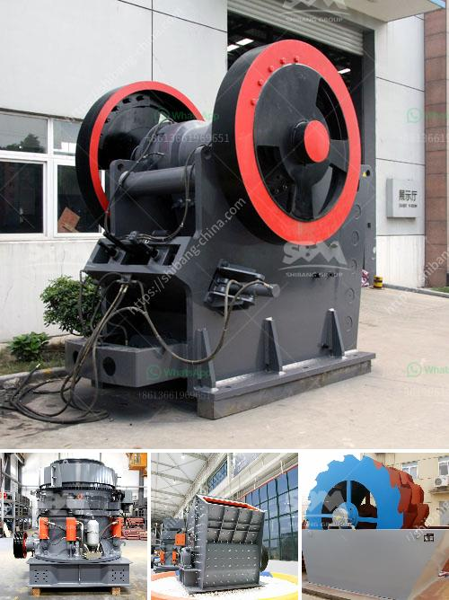

<h3>quartz crushing grinding mill</h3>
Quartz is widely distributed on the earth's surface and occurs in large quantities in many different geological formations. Since ancient times, mankind has used this mineral in various ways due to its unique properties. Quartz is renowned for its hardness, durability, and resistance to chemical weathering, making it a popular material in many industries.

However, before it can be used in its desired applications, quartz needs to undergo a complex process known as quartz processing. Quartz processing involves a series of crushing and grinding steps to reduce the size of the quartz stone and release the impurities trapped within.

One vital piece of equipment used for quartz processing is a quartz crushing grinding mill. This machine is specifically designed for reducing the size of quartz stone to obtain purified quartz powder for various industries. The mill uses mechanical force to crush and grind quartz stones, resulting in a fine powdered form that can be used in numerous applications.

The quartz crushing grinding mill typically consists of a rotor, grinding chamber, classifier, and control system. The rotor spins the quartz stones at high speeds, causing them to collide with each other, breaking them down into smaller particles. These particles are then further pulverized by the grinding elements, resulting in fine quartz powders.

The classifier in the mill separates the finer quartz particles from the coarser ones and ensures that only the desired particle size is collected. This control over the particle size distribution is crucial for the specific applications of quartz powder. Whether it is used as a raw material in the glass industry or as an essential component in the production of silicon chips, the accurate particle size distribution is paramount.

The quartz crushing grinding mill has several distinct advantages over other milling techniques. Firstly, it offers a wide range of particle size distributions, allowing manufacturers to tailor the powder according to their needs. This flexibility ensures that the quartz powder meets the specifications required by various industries.

Secondly, the quartz crushing grinding mill operates at a high production capacity, allowing for efficient processing of large quantities of quartz stones. This not only increases the productivity but also reduces the overall processing time, making it a cost-effective solution for quartz refining operations.

Furthermore, the machine is designed to effectively remove impurities from the quartz stone. Many impurities, such as iron oxides, mica, and carbonates, are commonly found in raw quartz materials. The milling process effectively breaks down these impurities, resulting in a high-purity quartz powder. This purity is crucial for industries such as electronics and optics, where impurities can cause defects and reduce the quality of the final products.

In conclusion, the quartz crushing grinding mill plays a vital role in the quartz processing industry. It offers a reliable and efficient method of obtaining the desired particle size and purity of quartz powder. With its high production capacity and ability to remove impurities, this machine is an essential tool for manufacturers across various industries. By investing in a quartz crushing grinding mill, businesses can ensure the quality of their quartz products and enhance their competitiveness in the market.
<h3>Contact us</h3><ul><li><strong>Whatsapp:&nbsp;<a href="https://wa.me/8613661969651">+8613661969651</a></strong></li><li><a href="https://swt.shibang-china.com/?git&amp;zhl&amp;quartz crushing grinding mill"><strong>Online Service(chat now)</strong></a></li></ul><h3>Related</h3><ul><li><a href='hydraulic roll crusher zenith.md'>hydraulic roll crusher zenith</a></li><li><a href='stone crusher and quarry for sale in pakistan.md'>stone crusher and quarry for sale in pakistan</a></li><li><a href='iron ore mines cost structure.md'>iron ore mines cost structure</a></li><li><a href='enquiry about crushing machine.md'>enquiry about crushing machine</a></li><li><a href='dolomite processing plant cost in india.md'>dolomite processing plant cost in india</a></li></ul>