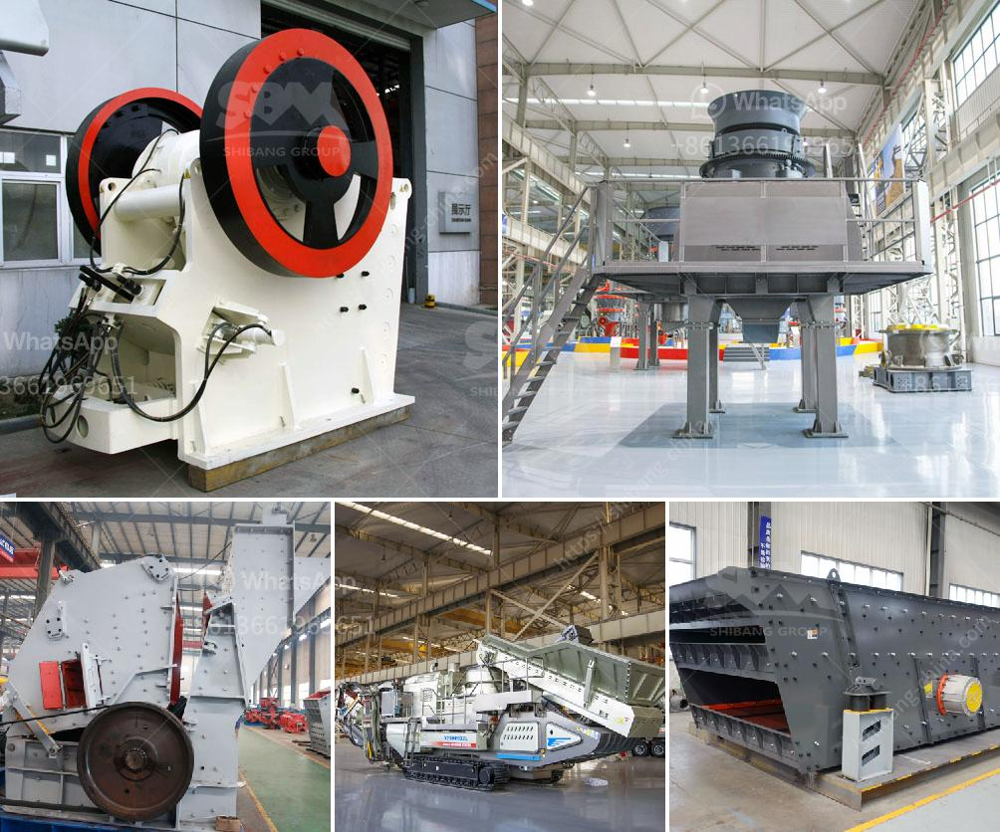

<h3>quartz grit making machine</h3>
Quartz grit making machine is a necessity for mining and processing of quartz. Quartz is found in abundance in various forms such as sand, clumps, pebbles, and even in massive boulders. However, it is the high-grade varieties that are most sought after for industrial purposes. Quartz grit is produced by crushing quartzite stones in large machinery and then sifting the resulting material into various grades. It is widely used as an abrasive material in industries such as construction, ceramics, glass, and even in the production of solar panels.

There are several types of machines used for making quartz grit, each with its unique features and capabilities. The most common type is the jaw crusher, which is used to crush large quartz stones into smaller particles. This machine works by applying pressure to the material, gradually breaking it down into smaller sizes. Another type is the cone crusher, which uses a gyrating cone to crush the material. Cone crushers are known for their high crushing efficiency and can produce quartz grit of even finer grades.

A vibrating screen is an important component of the quartz grit making machine as it is used to separate the crushed material into different grades based on size. The screen consists of a mesh with varying opening sizes, allowing the smaller particles to pass through while retaining the larger ones. This process ensures that the quartz grit produced is of uniform size and devoid of impurities.

Once separated, the quartz grit needs to be properly cleaned to remove any impurities such as dust, clay, or organic matter. For this purpose, a quartz grit washing machine is used. It works on the principle of water being sprayed onto the material, effectively washing away the impurities. The washed quartz grit is then dried using a dryer or in some cases, by exposure to the sun.

The final step in the production of quartz grit involves sieving the dried material to obtain different grades. This is done using a sieve machine, which consists of multiple layers of mesh with different opening sizes. As the material is sifted through the sieve, it gets sorted into different sizes, enabling the production of quartz grit in various grades as per market demand.

Quartz grit making machines are designed to be efficient, robust, and durable, allowing for continuous operation with minimal maintenance. They are also equipped with safety features to ensure the well-being of operators and prevent accidents. Additionally, these machines are often automated, reducing the need for manual labor and the associated costs.

In conclusion, quartz grit making machines play a crucial role in the mining and processing of quartz. They enable the production of high-quality quartz grit that is widely used in various industries. These machines are designed to crush, sift, wash, and grade the quartz stones, ensuring that the final product is of desired size and purity. With advancing technology, these machines are becoming more efficient, reliable, and environmentally friendly, contributing to sustainable quartz production.
<h3>Contact us</h3><ul><li><strong>Whatsapp:&nbsp;<a href="https://wa.me/8613661969651">+8613661969651</a></strong></li><li><a href="https://swt.shibang-china.com/?git&amp;zhl&amp;quartz grit making machine"><strong>Online Service(chat now)</strong></a></li></ul><h3>Related</h3><ul><li><a href='small rock crusher machine.md'>small rock crusher machine</a></li><li><a href='manufacturer of jaw crusher.md'>manufacturer of jaw crusher</a></li><li><a href='big stone crusher prices in south africa.md'>big stone crusher prices in south africa</a></li><li><a href='marble quarry mining in sudan.md'>marble quarry mining in sudan</a></li><li><a href='gypsum powder designed.md'>gypsum powder designed</a></li></ul>