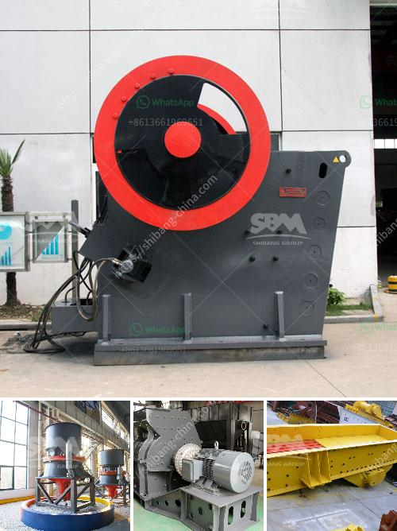

<h3>quartz making process</h3>
Quartz, the most abundant mineral in the Earth's crust, has been admired for its beauty and versatility for centuries. Whether used in jewelry, electronics, or industrial applications, quartz provides numerous benefits. Understanding the quartz making process sheds light on how this fascinating gemstone is transformed from raw material into a precious gem.

Quartz, chemically known as silicon dioxide (SiO2), consists of a crystalline structure that gives it its unique properties. To begin the quartz making process, artisans need high-quality raw materials. Quartz is primarily mined from naturally occurring quartz deposits or extracted from quartz sand using advanced techniques.

Once the quartz is collected, it undergoes a thorough cleaning process to remove impurities and debris. The cleaning ensures the quality of the final product by eliminating any unwanted substances that can affect the gem's clarity and color. Removing impurities also prevents any potential damage during subsequent manufacturing steps.

After cleaning, the quartz is carefully sorted into different size fractions based on its intended use. This step is crucial as particular applications require specific dimensions and shapes. Larger quartz pieces are often used for industrial purposes, such as manufacturing electronic components, while smaller fragments are used in jewelry-making.

The next step in the quartz making process involves grinding and polishing. The selected quartz is cut into precise shapes using specialized machinery. This step requires precision and skill to ensure accuracy and consistency. Skilled craftsmen use various cutting techniques, such as sawing, grinding, and drilling, to shape the quartz accordingly.

Once the shaping process is complete, the quartz pieces undergo grinding and polishing. This step enhances the clarity and brilliance of the gemstone, transforming it from a rough material into a vibrant and lustrous gem. Grinding is done using diamond or silicon carbide abrasives, gradually smoothing the surface and removing any imperfections.

Following the grinding process, the quartz undergoes a thorough polishing. Polishing buffs away any remaining scratches, further enhancing the gem's shine and brilliance. The exact method and materials used for polishing may vary depending on the desired finish and the intended application of the quartz.

After polishing, the quartz is carefully inspected to ensure that it meets the required quality standards. Skilled gemologists examine the gemstone under various lighting conditions to assess its clarity, color, and overall appearance. Any defects or flaws are addressed through additional polishing or, if necessary, the gem is discarded.

The final step in the quartz making process involves cutting and faceting, where the quartz is skillfully shaped into various designs and cuts. This step adds the finishing touches, transforming the gemstone into a unique and mesmerizing piece of jewelry or industrial component.

In conclusion, the quartz making process involves several intricate steps that turn raw material into a prized gemstone. From cleaning and sorting to grinding, polishing, and cutting, each step contributes to the final product's quality and appearance. Whether adorning a piece of jewelry or serving a functional purpose, quartz continues to captivate with its remarkable beauty and versatility. So, the next time you admire a quartz gem, remember the meticulous craftsmanship that transformed it from a raw material into a breathtaking gem.
<h3>Contact us</h3><ul><li><strong>Whatsapp:&nbsp;<a href="https://wa.me/8613661969651">+8613661969651</a></strong></li><li><a href="https://swt.shibang-china.com/?git&amp;zhl&amp;quartz making process"><strong>Online Service(chat now)</strong></a></li></ul><h3>Related</h3><ul><li><a href='bentonite powder mill manufacturers.md'>bentonite powder mill manufacturers</a></li><li><a href='nigeria minerals processing company.md'>nigeria minerals processing company</a></li><li><a href='feldspar ball mill porcess.md'>feldspar ball mill porcess</a></li><li><a href='hammer mill components.md'>hammer mill components</a></li><li><a href='vibrating screen price philippines.md'>vibrating screen price philippines</a></li></ul>