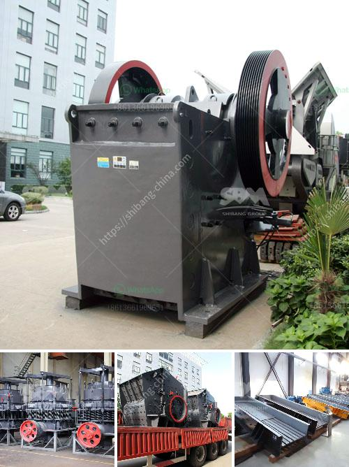

<h3>quartz marble making machine</h3>
In today's world, aesthetics play a crucial role in architecture, interior design, and various other industries. One material that has captivated the creative minds for centuries is marble. With its exquisite beauty, timeless elegance, and durability, marble has been a symbol of luxury and sophistication.

Traditionally, marble was extracted and processed manually, a labor-intensive and time-consuming process. However, with recent advancements in technology, the introduction of quartz marble making machines has revolutionized the marble industry.

These machines utilize cutting-edge technology to create quartz marble, a synthetic marble-like material, which exhibits all the stunning characteristics of natural marble. Quartz marble making machines offer a wide range of design options, textures, and patterns, allowing architects, interior designers, and homeowners to unleash their creativity and transform spaces like never before.

One of the main advantages offered by quartz marble making machines is efficiency. These machines can reduce the production time dramatically, allowing for quick turnaround times and meeting tight project deadlines. Traditional marble processing often involved several stages, including extraction, cutting, and polishing, which took a considerable amount of time. However, with quartz marble making machines, the entire fabrication process is streamlined, significantly increasing productivity.

Another benefit of quartz marble making machines is the consistent quality of the end product. Natural marble is known for its variations in color, veining, and texture, making it challenging to achieve uniformity in large-scale projects. Quartz marble, on the other hand, can be produced to have consistent patterns and colors, ensuring a seamless and coherent look throughout the given space. This allows for better control over the final outcome and meets the demands of architects and designers who require precise specifications.

Additionally, quartz marble making machines offer enhanced durability. Natural marble is prone to staining, scratching, and chipping, making it less ideal for high-traffic areas. Quartz marble, on the contrary, is engineered to be highly resistant to these common issues. The manufacturing process involves mixing quartz crystals with binders and pigments, resulting in a material that is more durable and long-lasting than natural marble. This durability makes quartz marble a popular choice for residential and commercial applications, from kitchen countertops to flooring in public spaces.

In terms of sustainability, quartz marble making machines have made significant strides. Natural marble extraction causes environmental damage, depletes natural resources, and generates waste. In contrast, quartz marble is a much more environmentally friendly alternative. The production process can be optimized to minimize waste, and since the material is fabricated rather than extracted, it eliminates the need for quarrying, reducing the carbon footprint substantially.

Quartz marble making machines have truly revolutionized the marble industry, offering a cost-effective, efficient, and sustainable alternative to natural marble. With their ability to produce consistent, high-quality products and the freedom to experiment with various design elements, architects and designers are no longer limited by the constraints of natural marble. As technology continues to evolve, we can expect even more advancements in quartz marble making machines, further pushing the boundaries of creativity and transforming the way we perceive and utilize marble in our living and working spaces.
<h3>Contact us</h3><ul><li><strong>Whatsapp:&nbsp;<a href="https://wa.me/8613661969651">+8613661969651</a></strong></li><li><a href="https://swt.shibang-china.com/?git&amp;zhl&amp;quartz marble making machine"><strong>Online Service(chat now)</strong></a></li></ul><h3>Related</h3><ul><li><a href='amenagement de station de concassage de 300 tonnes.md'>amenagement de station de concassage de 300 tonnes</a></li><li><a href='lime grinding machine manufacturer in kolhapur.md'>lime grinding machine manufacturer in kolhapur</a></li><li><a href='distributors of conveyor belts in malaysia.md'>distributors of conveyor belts in malaysia</a></li><li><a href='hammer crusher clinker.md'>hammer crusher clinker</a></li><li><a href='continuous or discontinuous ball mills.md'>continuous or discontinuous ball mills</a></li></ul>