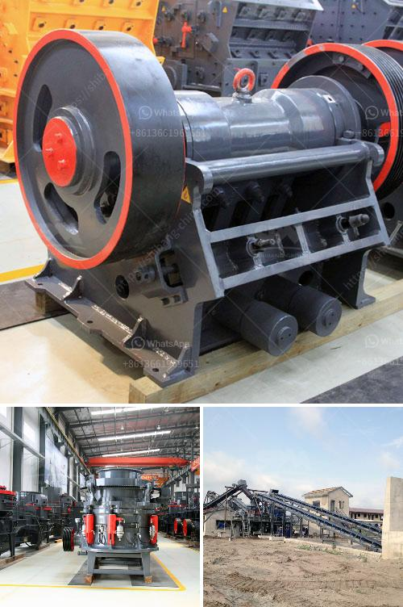

<h3>quartz movement production process</h3>
In the world of horology, quartz movements have revolutionized the watchmaking industry. Renowned for their accuracy and reliability, these timekeeping mechanisms are the product of an intricate and precise production process. Let us delve into the fascinating world of quartz movement production, where meticulous craftsmanship and advanced technology merge to create timepieces that keep ticking with unrivaled precision.

The journey of a quartz movement begins with the selection and sourcing of high-quality raw materials. The heart of this mechanism is the quartz crystal, usually made of natural or synthetic quartz. These crystals possess remarkable piezoelectric properties, meaning they generate electrical voltage when subjected to mechanical pressure. The raw quartz is carefully cut and shaped into tiny tuning fork-shaped pieces, ensuring the final crystal resonates at the desired frequency.

Once the quartz crystals are shaped to perfection, the next step in the production process involves assembling the various components that make up the movement. This intricate task requires skilled technicians who carefully handle and position delicate gears, hands, and batteries with meticulous precision. The movement must be built to tolerances of mere microns, as any slight misalignment or deviation can significantly impact the accuracy of the timepiece.

The heartbeat of a quartz movement is the integrated circuit, commonly referred to as the "brain" of the watch. This tiny piece of silicon contains carefully designed electronic circuits that regulate the flow of electricity, converting the vibrations of the quartz crystal into a consistent timekeeping rhythm. The integrated circuit is usually produced using advanced manufacturing techniques, including photolithography and etching, ensuring the highest level of precision and reliability.

After the movement is assembled and the integrated circuit is integrated into the mechanism, rigorous testing procedures are conducted to guarantee the accuracy of the timepiece. The movements are subjected to strict quality control measures, including temperature and shock resistance tests. These tests simulate various real-life scenarios to ensure the watch can withstand everyday wear and tear while maintaining its exceptional precision.

The final stages of quartz movement production involve the assembly of the timepiece itself. Manufacturers carefully select and design aesthetically pleasing watch cases, dials, and hands that enhance the overall appeal of the timepiece. This process combines the principles of traditional watchmaking with modern design techniques, allowing quartz watches to be both functional and visually appealing.

Quartz movement production has come a long way since the introduction of the first quartz watch by Seiko in the 1960s. Today, advancements in technology have allowed for more sophisticated and refined timekeeping mechanisms, offering increased accuracy and longer battery life. Modern quartz movements also often incorporate additional features such as chronographs, alarms, and even Bluetooth connectivity.

In conclusion, the production process of a quartz movement is a testament to the marriage of precision craftsmanship and advanced technology. From the selection and shaping of the quartz crystals to the assembly and testing of the movement, every step is executed with utmost care and attention to detail. The result is a timekeeping masterpiece that combines accuracy, reliability, and aesthetic appeal, making quartz watches the preferred choice for millions of individuals around the world.
<h3>Contact us</h3><ul><li><strong>Whatsapp:&nbsp;<a href="https://wa.me/8613661969651">+8613661969651</a></strong></li><li><a href="https://swt.shibang-china.com/?git&amp;zhl&amp;quartz movement production process"><strong>Online Service(chat now)</strong></a></li></ul><h3>Related</h3><ul><li><a href='sand making machine saudi.md'>sand making machine saudi</a></li><li><a href='construction equipment manufacturer in turkey.md'>construction equipment manufacturer in turkey</a></li><li><a href='gravel screeners for sale craigslist.md'>gravel screeners for sale craigslist</a></li><li><a href='quartz making process.md'>quartz making process</a></li><li><a href='large capacity ton per hour limestone crushers.md'>large capacity ton per hour limestone crushers</a></li></ul>