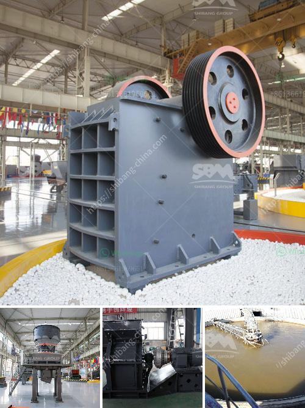

<h3>quartz plant manufacturing process</h3>
Quartz, also known as engineered stone, has gained immense popularity in the construction industry over the years due to its durability, aesthetic appeal, and low maintenance requirements. This man-made material is created by combining 93% natural quartz crystals with 7% resin binder and pigments, resulting in a highly versatile and customizable product. In this article, we will walk through the quartz plant manufacturing process to better understand how this remarkable material is made.

The first step in the quartz manufacturing process is the selection of raw materials. High-quality quartz crystals of various sizes and colors are sourced from different regions worldwide. These raw materials undergo an initial inspection to ensure that they meet the required standards for quartz manufacturing.

Once the raw materials are selected, they are carefully mixed together in precise proportions. The production process requires a precise combination of natural quartz, resin binder, and pigments to achieve the desired color and consistency. The mixture is then poured into molds, where it is compacted under high pressure to remove any excess air.

After molding, the quartz slabs are then cured in a specialized oven to ensure the complete bonding of the quartz crystals and resin binder. This curing process can take several hours, during which the temperature and pressure are closely monitored to guarantee optimal results.

Once the curing process is complete, the hardened quartz slabs are ready for finishing. The slabs undergo a calibration process to ensure uniform thickness and a smooth surface. This is followed by polishing, a critical step that gives quartz its characteristic shiny appearance. Polishing is carried out using advanced machinery with abrasive pads to achieve the desired level of smoothness and reflectivity.

After polishing, the slabs are inspected for any defects such as cracks, chips, or discoloration. Any flawed slabs are discarded, ensuring that only the highest quality products are delivered to the market.

The final step in the quartz manufacturing process is the fabrication and installation. The quartz slabs are cut and shaped according to the specific requirements of the project. This can involve processes such as edging, beveling, and CNC routing to create the desired design and functionality.

Once the fabrication is completed, the quartz slabs are carefully transported to the installation site. The installation process involves precise measurements and the use of specialized adhesives to securely attach the quartz slabs to countertops, backsplashes, or any other designated area.

In conclusion, the quartz manufacturing process is a meticulous and detailed journey from the selection of raw materials to the installation of the final product. The combination of advanced technology, precise mixing, curing, and fabrication ensures that quartz surfaces meet the high standards of quality and aesthetics demanded by consumers. With its exceptional durability, versatility, and stunning appearance, it is no wonder why quartz has become a preferred choice for countless residential and commercial projects worldwide.
<h3>Contact us</h3><ul><li><strong>Whatsapp:&nbsp;<a href="https://wa.me/8613661969651">+8613661969651</a></strong></li><li><a href="https://swt.shibang-china.com/?git&amp;zhl&amp;quartz plant manufacturing process"><strong>Online Service(chat now)</strong></a></li></ul><h3>Related</h3><ul><li><a href='crusher impact germany.md'>crusher impact germany</a></li><li><a href='crusher machine manufacturers in india.md'>crusher machine manufacturers in india</a></li><li><a href='project cost of 100 tpd opc cement plant.md'>project cost of 100 tpd opc cement plant</a></li><li><a href='pakistan quarry crusher manufacturer.md'>pakistan quarry crusher manufacturer</a></li><li><a href='looking for limestone crushing contractor.md'>looking for limestone crushing contractor</a></li></ul>