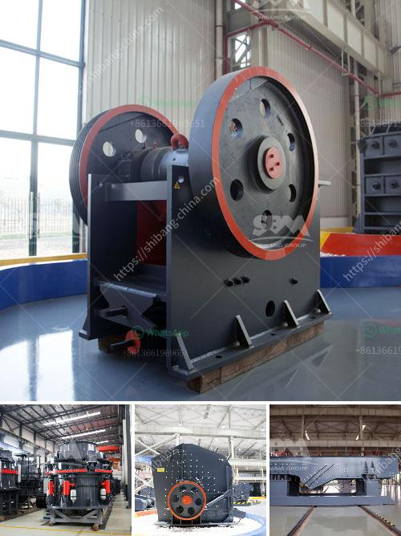

<h3>quartz powder making machine</h3>
Quartz is one of the most abundant minerals found in the Earth's crust. It is widely used in various industries such as glass, ceramics, metallurgy, and construction. Quartz powder, also known as silica powder, is a key ingredient in these industries.

To obtain high-quality quartz powder, the most crucial step is to choose a suitable quartz powder making machine. A good machine will not only provide high output and efficiency but also ensure the purity and whiteness of the final product. Let's delve into the types and features of quartz powder making machines.

One of the commonly used machines for making quartz powder is the ball mill. It is mainly used for grinding and processing quartz minerals, but also suitable for calcium carbonate and other non-flammable and explosive materials. Its grinding chamber is continuously closed during operation, which prevents dust leakage and ensures a clean working environment.

Another type of machine for making quartz powder is the Raymond mill. Compared to the ball mill, Raymond mill has higher grinding efficiency, lower power consumption, and smaller footprint. However, its fineness of output powder is relatively low, and it is not suitable for processing fine quartz powder.

For producing ultra-fine quartz powder, an ultrafine grinding mill is the best choice. It integrates grinding, drying, classifying, and conveying into one machine. It has higher grinding efficiency and finer particle size, making it suitable for producing quartz powder with a fineness of 200-2500 mesh.

In addition to the type of machine, the quality of the machine also plays a vital role in quartz powder production. Some key features to consider when choosing a quartz powder making machine are:

1. Material quality: The machine should be made of high-quality steel and components to ensure its durability and stability during operation.

2. Grinding roller and grinding ring: These parts are crucial for grinding quartz powder. They should be made of wear-resistant materials to prolong their service life.

3. Dust collection system: A good machine should have an effective dust collection system to minimize environmental pollution. It should also have noise reduction measures to create a quieter working environment.

4. Automatic control system: An advanced quartz powder making machine should have an automatic control system that can adjust the fineness of the final product according to the needs of different industries.

5. Energy-saving and environmental protection: With the increasing emphasis on sustainable development, a quartz powder making machine that consumes less energy and produces less pollution is highly desirable.

In conclusion, choosing the right quartz powder making machine is crucial for producing high-quality quartz powder. The type of machine should be selected based on the desired fineness of the powder, while considering factors such as grinding efficiency, power consumption, and environmental impact. Paying attention to the quality and features of the machine will ensure the success of the quartz powder production process.
<h3>Contact us</h3><ul><li><strong>Whatsapp:&nbsp;<a href="https://wa.me/8613661969651">+8613661969651</a></strong></li><li><a href="https://swt.shibang-china.com/?git&amp;zhl&amp;quartz powder making machine"><strong>Online Service(chat now)</strong></a></li></ul><h3>Related</h3><ul><li><a href='sand crushing grinding screening production machinerys.md'>sand crushing grinding screening production machinerys</a></li><li><a href='accessories for conveyor belts.md'>accessories for conveyor belts</a></li><li><a href='small scale tin mining design.md'>small scale tin mining design</a></li><li><a href='looking for small coal processing equipment.md'>looking for small coal processing equipment</a></li><li><a href='crusher 50 ton per hour price.md'>crusher 50 ton per hour price</a></li></ul>