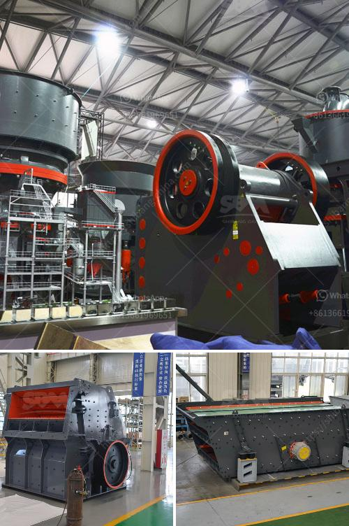

<h3>quartz production process</h3>
Quartz is a versatile and highly sought-after material used in a variety of industries, ranging from construction and electronics to jewelry and countertops. But have you ever wondered how this beautiful and durable material is produced? 

The process of quartz production involves several steps, beginning with the extraction of raw quartz from mines or quarries. Once the quartz is extracted, it is carefully sorted and cleaned to remove any impurities or foreign substances. This cleaning process ensures that only the purest and highest quality quartz is used.

Next, the quartz is crushed into small, uniform pieces to facilitate the grinding process. These crushed quartz particles are then subjected to intense heat and pressure to create blocks or slabs of solid quartz. This process, known as sintering, helps to fuse the quartz particles together, resulting in a strong and homogeneous material.

After the sintering process, the quartz slabs are polished to achieve a smooth and reflective surface. This is done by using advanced machinery, which gradually grinds and polishes the quartz until it reaches the desired finish. This process requires precision and expertise to ensure that the final product meets the highest standards of quality.

Once the polishing is complete, the quartz slabs are carefully inspected for any imperfections or flaws. Any defective slabs are discarded, while the flawless ones are cut and shaped according to specific measurements and requirements. These customized quartz pieces can be used for various applications, such as kitchen countertops, vanity tops, or even as decorative elements.

Overall, the production process of quartz involves a combination of rigorous extraction, cleaning, grinding, sintering, polishing, and quality control measures. This ensures that the final product is not only visually appealing but also durable and long-lasting. With its unique properties and attractive appearance, it is no wonder why quartz continues to be in high demand across industries worldwide.
<h3>Contact us</h3><ul><li><strong>Whatsapp:&nbsp;<a href="https://wa.me/8613661969651">+8613661969651</a></strong></li><li><a href="https://swt.shibang-china.com/?git&amp;zhl&amp;quartz production process"><strong>Online Service(chat now)</strong></a></li></ul><h3>Related</h3><ul><li><a href='china vertical roller mill.md'>china vertical roller mill</a></li><li><a href='quarry stone crusherequipment.md'>quarry stone crusherequipment</a></li><li><a href='enquiry about sand making machine.md'>enquiry about sand making machine</a></li><li><a href='small used stone crusher machine in india.md'>small used stone crusher machine in india</a></li><li><a href='fairly used quarry crusher in nigeria price.md'>fairly used quarry crusher in nigeria price</a></li></ul>