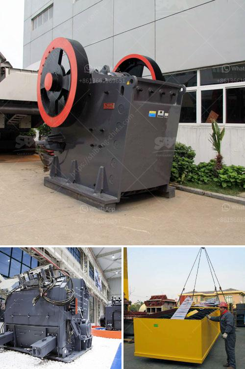

<h3>quotation for crusher</h3>
Crushing has always been an essential process within construction, mining, and other industries. With rapidly evolving technology and innovative solutions, crushers have become more efficient and versatile than ever before. When it comes to choosing the right crusher for your operations, it's crucial to assess your specific requirements and obtain a detailed quotation that encompasses all essential factors. This article will explore the importance of quotations and provide insights into what to look for when sourcing a crusher quotation.

A comprehensive quotation for a crusher includes multiple components that contribute to the overall efficiency and productivity of your operations. These components typically include the crusher type, capacity, features, warranty, delivery time, and price. It's essential to obtain a detailed quotation to ensure that the crusher meets your specific needs and falls within your budget.

The first crucial factor to consider is the crusher type. There are various types of crushers available, including jaw crushers, cone crushers, impact crushers, and gyratory crushers. Each type has its unique advantages and is suitable for different applications. By understanding your specific requirements, you can choose the right crusher type that offers optimal performance and cost-efficiency.

Another vital factor is the capacity of the crusher. The capacity determines the maximum amount of material the crusher can handle per hour. It's essential to identify your desired production rate to select a crusher with the appropriate capacity. Ensuring that the crusher can handle your expected output is crucial to avoid productivity losses and unnecessary downtime.

When obtaining a quotation, it's crucial to thoroughly examine the features of the crusher. Features such as adjustable settings, automated controls, maintenance accessibility, and safety mechanisms can significantly impact the crusher's efficiency and ease of operation. Assessing these features allows you to identify the crusher that offers the best value for your operations.

Warranty is another essential consideration when evaluating a quotation. A comprehensive warranty coverage protects your investment and provides peace of mind. Ensure the quoted warranty covers critical components, such as the crusher's mainframe, eccentric shaft, and bearings. Additionally, check if extended warranty options are available to further safeguard your investment.

Delivery time is a factor that cannot be overlooked while assessing a quotation. Construction or mining projects often have strict deadlines, and any delays in equipment delivery can lead to costly setbacks. It's crucial to clarify the expected delivery time and ensure that it aligns with your project's timeline to avoid disruptions.

Lastly, the price is a crucial aspect to consider when obtaining a crusher quotation. While cost is an important factor, it should not be the sole determinant. Focus on value for money rather than opting for the cheapest option. Evaluate the crusher's quality, efficiency, and reliability, and compare prices from multiple suppliers to make an informed decision.

In conclusion, obtaining a comprehensive quotation for a crusher is essential for efficient and cost-effective crushing operations. It enables you to assess various factors such as crusher type, capacity, features, warranty, delivery time, and price to select the most suitable option for your specific requirements. By focusing on the right factors, you can make an informed decision and invest in a crusher that provides optimal performance, longevity, and value for money.
<h3>Contact us</h3><ul><li><strong>Whatsapp:&nbsp;<a href="https://wa.me/8613661969651">+8613661969651</a></strong></li><li><a href="https://swt.shibang-china.com/?git&amp;zhl&amp;quotation for crusher"><strong>Online Service(chat now)</strong></a></li></ul><h3>Related</h3><ul><li><a href='sand screening machine south africa.md'>sand screening machine south africa</a></li><li><a href='top mobile crusher.md'>top mobile crusher</a></li><li><a href='amenagement de station de concassage de 300 tonnes.md'>amenagement de station de concassage de 300 tonnes</a></li><li><a href='marbel grinding process.md'>marbel grinding process</a></li><li><a href='allis chalmers gyratory crushers.md'>allis chalmers gyratory crushers</a></li></ul>