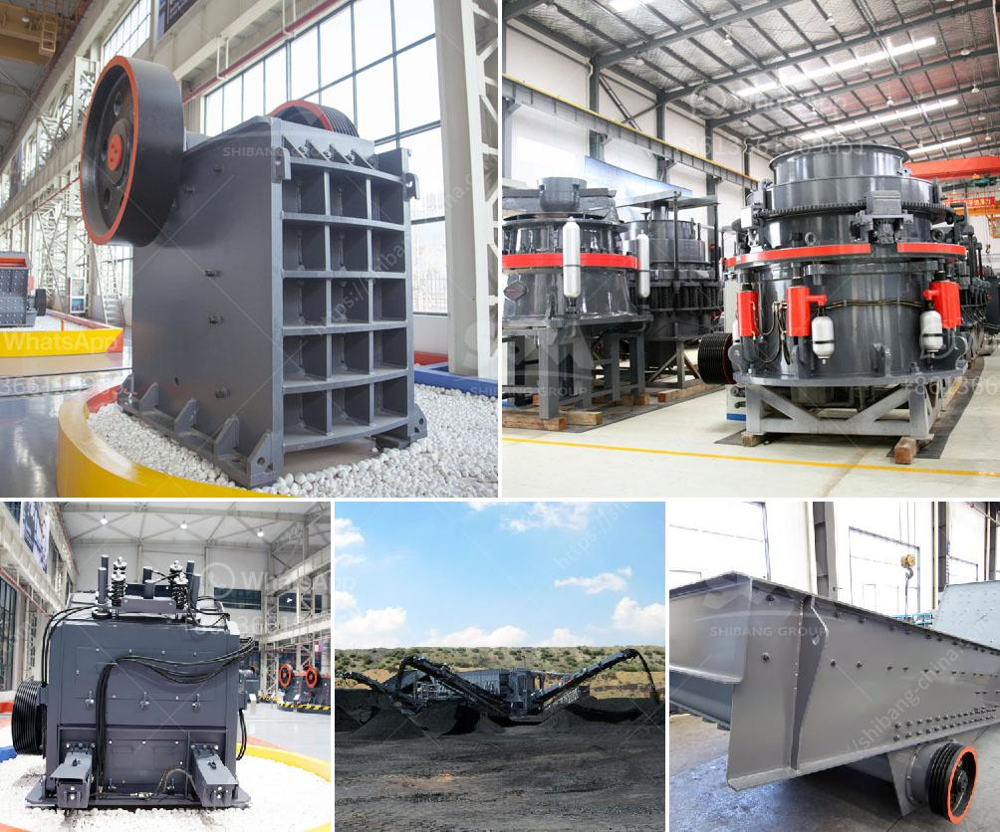

<h3>quotation for crushing and screening</h3>
Crushing and screening are essential processes in the mining sector. They enable efficient extraction and processing of valuable minerals and materials from the earth. In the past, traditional miners were forced to haul raw ores and waste rocks manually by labor-intensive methods, which was not only time-consuming but also financially draining. However, advancements in technology have revolutionized the mining industry, leading to the development of efficient and cost-effective crushing and screening equipment. As a result, mining companies can now obtain accurate quotations for these services, optimizing their productivity and profitability.

The process of crushing involves breaking down large rocks and minerals into smaller, more manageable sizes. It is a crucial step in mineral processing, as it prepares the ore for further grinding or separation. Several factors contribute to the success of the crushing process, including the type of crusher used, the feed material's size, hardness, and moisture content, as well as the desired final product size. Therefore, obtaining an accurate quotation for crushing services requires detailed information and analysis of these factors.

Screening, on the other hand, is the process of separating different-sized materials and particles into specified fractions. It is commonly used to classify and segregate extracted minerals based on size, shape, and density. Screening plays a significant role in the efficient recovery of valuable minerals, as it ensures that only the appropriate-sized particles proceed to the next stage of processing. To provide an accurate quotation for screening services, mining companies need to consider factors such as screen type, screen size, inclination, and the desired end product specifications.

The advancements in crushing and screening equipment have not only increased efficiency but also led to significant cost reductions. Modern machinery and technologies, such as computer-aided design, automation, and remote monitoring, enable optimized performance, minimal downtime, and increased productivity. Real-time data analytics and remote monitoring systems allow for quick identification of issues and preventive maintenance, minimizing disruptions and extending the lifespan of equipment. These technological advancements have made the on-site crushing and screening process more efficient, cost-effective, and environmentally friendly.

Quotations for crushing and screening services can vary depending on several factors. Some of the key cost determinants include the type and capacity of the equipment required, the complexity of the project, the quantity of material to be processed, and the desired output. Additionally, transportation costs, labor costs, power consumption, and any potential environmental considerations must be factored in. Mining companies can approach numerous equipment suppliers and service providers for quotations, as competition in the market ensures competitive pricing.

In conclusion, the availability of accurate quotations for crushing and screening services has revolutionized the mining industry. The advanced equipment and technologies have improved efficiency, reduced costs, and optimized productivity. Mining companies can now obtain detailed and credible quotations tailored to their specific needs, allowing them to make informed decisions for their crushing and screening processes. These technological advancements, coupled with fierce market competition, have empowered mining companies to unlock efficiency and maximize profitability in the ever-evolving mining sector.
<h3>Contact us</h3><ul><li><strong>Whatsapp:&nbsp;<a href="https://wa.me/8613661969651">+8613661969651</a></strong></li><li><a href="https://swt.shibang-china.com/?git&amp;zhl&amp;quotation for crushing and screening"><strong>Online Service(chat now)</strong></a></li></ul><h3>Related</h3><ul><li><a href='roller crusher brick making machine.md'>roller crusher brick making machine</a></li><li><a href='stone pickers machine in india.md'>stone pickers machine in india</a></li><li><a href='grinding mill for sale servants.md'>grinding mill for sale servants</a></li><li><a href='mobile stone crusher in germany.md'>mobile stone crusher in germany</a></li><li><a href='brazil best crusher manufacturing companies.md'>brazil best crusher manufacturing companies</a></li></ul>