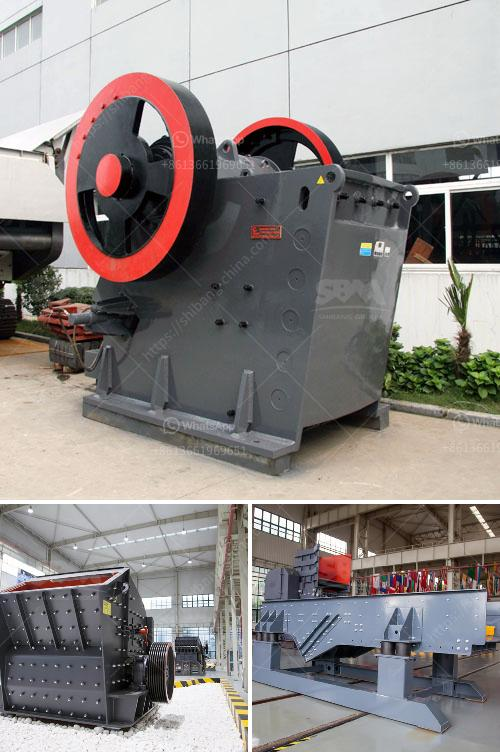

<h3>quote for sand making machine</h3>
A sand making machine, also known as a vertical shaft impact crusher, is a type of crusher that facilitates grinding and crushing of rocks, stones, and minerals through the use of high-speed rotating impellers. This state-of-the-art machinery is designed specifically to produce sand in various grain sizes, making it an invaluable resource in the construction, mining, and manufacturing industries.

One of the key components of a sand making machine is the rotor. The rotor consists of a main shaft, wear-resistant plates, and impellers. When the machine is in operation, the impellers spin at high speeds, throwing the rocks and stones against the wear-resistant plates to crush them into fine particles. The crushed particles then collide with each other as they fall, creating additional impact and further reducing their size. This continuous process of crushing and grinding ultimately results in the production of sand.

The sand produced by a high-quality sand making machine is widely used in various construction applications. It serves as a key ingredient in the production of concrete, asphalt, and mortar, which are essential for building sturdy structures. Additionally, sand is used in the manufacturing of glass, ceramics, and other industrial products. Its versatile nature and widespread application make it a valuable resource in various industries.

Investing in a sand making machine can yield significant benefits for businesses. By producing their own sand, companies can reduce their reliance on external sources, thereby saving costs in the long run. Furthermore, a sand making machine allows businesses to have greater control over the quality and specifications of the sand they produce. This can be particularly advantageous, as different construction projects may require sand with specific characteristics, such as varying grain sizes or specific mineral compositions.

When considering the purchase of a sand making machine, it is important to obtain a quote from the manufacturer or supplier. The cost of a sand making machine can vary depending on several factors, including its production capacity, power consumption, and overall efficiency. Additionally, the availability of spare parts and maintenance services should also be taken into consideration. Obtaining a comprehensive quote ensures that businesses have a clear understanding of the investment required and can make informed decisions about which machine best suits their needs.

In conclusion, a sand making machine is a valuable asset for businesses in the construction, mining, and manufacturing industries. It allows for the production of high-quality sand, which is essential for various applications. Investing in a sand making machine offers numerous benefits, including cost savings and enhanced control over the sand production process. To make an informed decision, it is crucial to obtain a detailed quote that encompasses all aspects of the machine, including its cost, production capacity, and maintenance requirements. With the right sand making machine, businesses can streamline their operations and meet the growing demand for sand in the market.
<h3>Contact us</h3><ul><li><strong>Whatsapp:&nbsp;<a href="https://wa.me/8613661969651">+8613661969651</a></strong></li><li><a href="https://swt.shibang-china.com/?git&amp;zhl&amp;quote for sand making machine"><strong>Online Service(chat now)</strong></a></li></ul><h3>Related</h3><ul><li><a href='quarry stone dressing machine.md'>quarry stone dressing machine</a></li><li><a href='mini jaw crusher for sale south africa.md'>mini jaw crusher for sale south africa</a></li><li><a href='small limestone plant.md'>small limestone plant</a></li><li><a href='crusher price peru stone.md'>crusher price peru stone</a></li><li><a href='total process of gypsum powder plant.md'>total process of gypsum powder plant</a></li></ul>