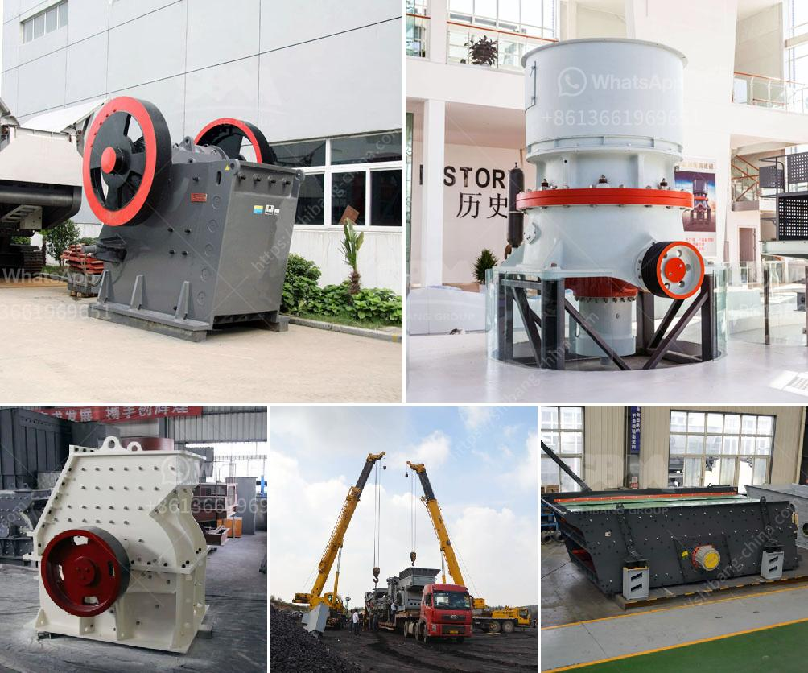

<h3>raymond 5 roller mill</h3>
The Raymond 5 Roller Mill is a popular grinding mill known for its exceptional performance and versatility. Built to meet the demands of various grinding applications, this mill can efficiently grind materials ranging from limestone to coal and many other minerals. With its advanced technology and reliable performance, the Raymond 5 Roller Mill has become a preferred choice for many industrial and specialty grinding operations.

One of the key features that sets the Raymond 5 Roller Mill apart is its ability to produce a uniform and fine grind. With five strategically placed rollers, this mill ensures that the grinding process is evenly distributed across the entire grinding surface. This not only leads to efficient grinding but also minimizes the chance of uneven wear on the grinding elements.

Another significant advantage of the Raymond 5 Roller Mill is its energy efficiency. Equipped with a high-capacity motor, this mill converts electrical energy into grinding power with impressively low energy consumption. This makes it an ideal choice for grinding operations looking to reduce their carbon footprint and operating costs.

The Raymond 5 Roller Mill also offers exceptional reliability. Designed to withstand the rigors of continuous operation, this mill is built with top-quality materials and components. The robust construction ensures that the mill operates smoothly even in the most demanding grinding applications. Additionally, the sophisticated lubrication system and advanced sealing technology further enhance the mill's reliability, reducing the risk of unexpected downtime and costly repairs.

Furthermore, the Raymond 5 Roller Mill is incredibly versatile. It can be adapted to grind a wide range of materials, making it suitable for various industries. Whether it's grinding limestone for cement production, coal for power generation, or minerals for pharmaceutical applications, this mill can handle them all. This versatility allows businesses to streamline their grinding processes by using a single mill for multiple material types.

In addition to its performance and versatility, the Raymond 5 Roller Mill is also designed with user convenience in mind. The intuitive control panel enables operators to easily adjust grinding parameters and monitor the mill's performance in real-time. The mill's compact design ensures easy installation and maintenance, maximizing operational efficiency.

Overall, the Raymond 5 Roller Mill is a reliable and efficient grinding solution that offers exceptional performance across a wide range of materials. Its ability to deliver a uniform and fine grind, coupled with its energy efficiency and versatility, makes it an excellent choice for various grinding applications. Furthermore, its robust construction and user-friendly design make it a reliable and convenient option for businesses of all sizes. If you are looking for a grinding mill that can meet your demanding requirements, the Raymond 5 Roller Mill should be on your radar.
<h3>Contact us</h3><ul><li><strong>Whatsapp:&nbsp;<a href="https://wa.me/8613661969651">+8613661969651</a></strong></li><li><a href="https://swt.shibang-china.com/?git&amp;zhl&amp;raymond 5 roller mill"><strong>Online Service(chat now)</strong></a></li></ul><h3>Related</h3><ul><li><a href='quarry crusher rules.md'>quarry crusher rules</a></li><li><a href='machinery for copper plant.md'>machinery for copper plant</a></li><li><a href='price list of grinding equipment for sale.md'>price list of grinding equipment for sale</a></li><li><a href='ball mill small for sale.md'>ball mill small for sale</a></li><li><a href='crusher made in taiwan.md'>crusher made in taiwan</a></li></ul>