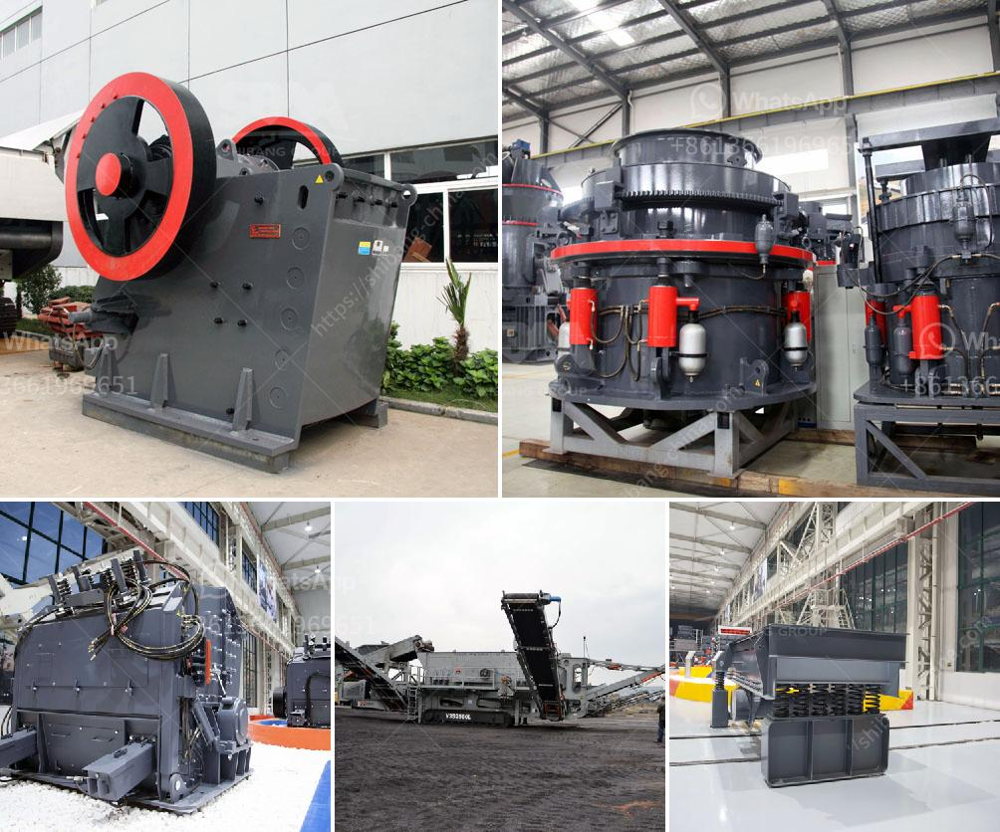

<h3>raymond machine for sale</h3>
When it comes to industrial material handling, efficiency and productivity are the top priorities for any business. This is where the versatile and reliable Raymond machine comes into the picture. With its exceptional build quality and advanced features, Raymond machines have become the go-to choice for many companies across various industries. If you are in the market for a top-notch machine, the sale of Raymond machines should have your undivided attention.

With a wide array of models available, Raymond offers solutions tailored to meet the specific needs of different industries. Whether you are involved in warehousing, manufacturing, or logistics, there is a Raymond machine that will surely enhance your material handling operations. From electric stackers and pallet trucks to reach trucks and forklifts, you can find a Raymond machine to handle a wide range of loads and tasks.

One of the key advantages of Raymond machines is their cutting-edge technology. They boast features like integrated telemetry systems, advanced monitoring capabilities, and comprehensive safety features. These innovations not only enhance productivity but also improve the overall safety of the operators and those working around the machine. With a Raymond machine, you can rest assured knowing that you are investing in a product that prioritizes efficiency and worker safety.

Additionally, Raymond machines are built to last. The sturdy construction and durable components ensure that these machines can withstand the most demanding industrial environments. They are designed for heavy-duty use, which means you can rely on them day after day, year after year. When you purchase a Raymond machine, you are making a long-term investment in your material handling operations.

What's more, Raymond machines offer exceptional maneuverability and ease of use. With advanced steering systems and ergonomically designed operator compartments, these machines are comfortable to operate and provide precise control. The operator-friendly features go a long way in reducing fatigue and increasing productivity. By investing in a Raymond machine, you are not only improving your material handling efficiency but also creating a better work environment for your operators.

Now that you know the benefits of Raymond machines, you might be wondering where to find them for sale. There are various authorized dealers and distributors of Raymond machines around the world. These reputable sellers offer a wide selection of models to choose from, ensuring that you can find the perfect machine for your specific needs. By working with an authorized seller, you can rest assured that you are purchasing a genuine Raymond machine, accompanied by professional support and after-sales service.

In conclusion, if you are looking for a high-quality machine to enhance your industrial material handling operations, consider the sale of Raymond machines. With their advanced technology, reliability, and operator-friendly design, Raymond machines are the perfect solution for businesses across various industries. Invest in a Raymond machine today and experience the difference it can make in your productivity and efficiency.
<h3>Contact us</h3><ul><li><strong>Whatsapp:&nbsp;<a href="https://wa.me/8613661969651">+8613661969651</a></strong></li><li><a href="https://swt.shibang-china.com/?git&amp;zhl&amp;raymond machine for sale"><strong>Online Service(chat now)</strong></a></li></ul><h3>Related</h3><ul><li><a href='how to setup the manganese ore processing plant.md'>how to setup the manganese ore processing plant</a></li><li><a href='specification for stone crushing for roads.md'>specification for stone crushing for roads</a></li><li><a href='small scale tin mining design.md'>small scale tin mining design</a></li><li><a href='allis chalmers gyratory crushers.md'>allis chalmers gyratory crushers</a></li><li><a href='stone ball mill up mesh.md'>stone ball mill up mesh</a></li></ul>