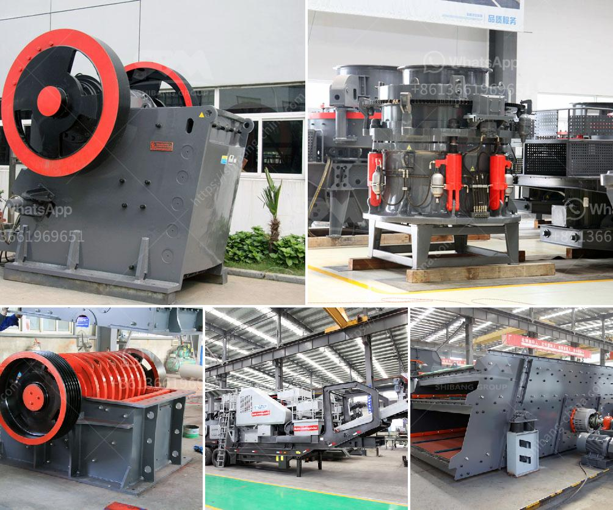

<h3>raymond mill manufactrer in udaipur</h3>
Raymond mill, also known as Raymond grinding mill, is commonly used in the grinding of mineral materials. Raymond mill manufacturer in Udaipur, a city in the western state of Rajasthan, has been producing and supplying grinding machines such as Raymond mills for decades.

Raymond mill is mainly used for grinding non-flammable and non-explosive materials with Moh's hardness less than 7 and humidity less than 6%. It is widely used in mining, construction, chemical industry, metallurgy, and other industries. The final product size can be adjusted within the range of 80-325 mesh.

Being a reliable and experienced manufacturer, the Raymond mill provides a complete set of high-quality equipment that can be used in various grinding applications. This mill is known for its outstanding performance, environmentally friendly design, and low maintenance.

The Raymond mill manufacturer in Udaipur offers an organized production process, ensures strict quality control measures, and maintains constant communication with customers to understand their requirements. They have a team of skilled professionals who are dedicated to delivering efficient and advanced grinding solutions.

Apart from offering standard Raymond mills, the manufacturer also provides customized grinding solutions to meet specific needs. They have a well-equipped infrastructure and modern technology to manufacture Raymond mills with high precision and superior quality.

Furthermore, the Raymond mill manufacturer in Udaipur provides excellent after-sales service, including installation, maintenance, and technical support. They ensure that their customers receive prompt assistance and can optimize the performance of the equipment.

In conclusion, the Raymond mill manufacturer in Udaipur has built a reputation for providing reliable and efficient grinding machines. With their expertise and commitment to customer satisfaction, they continue to serve various industries with high-quality Raymond mills. Whether it is for mining, construction, or chemical applications, their machines offer superior performance, durability, and value for money.
<h3>Contact us</h3><ul><li><strong>Whatsapp:&nbsp;<a href="https://wa.me/8613661969651">+8613661969651</a></strong></li><li><a href="https://swt.shibang-china.com/?git&amp;zhl&amp;raymond mill manufactrer in udaipur"><strong>Online Service(chat now)</strong></a></li></ul><h3>Related</h3><ul><li><a href='concrete crushers for rent nigeria.md'>concrete crushers for rent nigeria</a></li><li><a href='basalt stone processing plant.md'>basalt stone processing plant</a></li><li><a href='machine de fabrication de sable de platre.md'>machine de fabrication de sable de platre</a></li><li><a href='stone sand making machine in nignia.md'>stone sand making machine in nignia</a></li><li><a href='gold stamping mill prices in south africa.md'>gold stamping mill prices in south africa</a></li></ul>