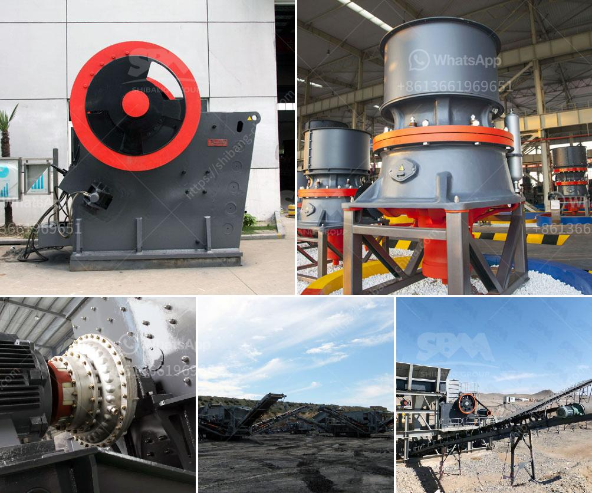

<h3>raymond mill operation</h3>
Raymond Mill, also known as Raymond Grinder or Pendulum Grinder, is designed by Clirik Machinery with Germany technology. The Raymond mill is more efficient than ball mill in some areas, with features of closed circuit for high fine powder devices.

Raymond mill is widely used in the fields of metallurgy, construction, chemical industry, mining, highway construction etc,. The granularity of the finished powder size can be adjusted between 50 and 325 mesh (315-45 micron). Examples of some materials processed by Raymond mill include: limestone, calcite, barite, dolomite, marble, talcum, gypsum, kaolin, bentonite, medical stone, rock phosphate, manganese ore, iron ore, quartz, active carbon, carbon black, ceramic, coal, etc.

The operation process of Raymond mill mainly includes the following three aspects: the preparation before starting, the operation and maintenance during use, and the shutdown and maintenance after use.

Check whether the connecting bolts and nuts of each part are tightened, whether the lubricating oil, hydraulic oil, cooling water and other systems are filled, whether the dust collector and pipeline are tight, etc. In addition, turn the manual handle of the fan to check whether it rotates flexibly.

(b) Start the Raymond mill in order: start the electromagnetic vibrating feeder first, and then start the host unit;

(c) When the Raymond mill is started, pay attention to whether the current and voltage are normal, and whether the feeding equipment and the conveying equipment are abnormal;

(d) Attention should be paid to the temperature of the main bearing during operation. If it exceeds the specified temperature, timely analysis and inspection should be carried out;

(e) Regularly check the wearing degree of the wearing parts, and replace or repair them in time if necessary;

(f) Pay attention to the moisture content of the material during grinding. If it exceeds the specified standard, it should be dried first, and then ground after reaching the standard.

(c) Dust and debris in the Raymond mill need to be cleaned up regularly to ensure the cleanliness of the machine and the stable operation of the equipment;

(d) Regularly check the wearing parts of Raymond mill, such as grinding roller, grinding ring, blade, etc., and replace them if necessary;

In summary, Raymond mill is a high-efficiency grinding equipment that can be used to grind various non-metallic minerals with Mohs hardness below 7 and humidity below 6%, such as limestone, calcite, activated carbon, talc, dolomite, titanium dioxide, quartz, bauxite, marble, feldspar, barite, fluorite, gypsum, ilmenite, phosphate rock, clay, graphite, clay, kaolin, coal gangue, wollastonite, magnetite, metal Silicon, humic acid, manganese ore, etc. When operating the Raymond mill, attention should be paid to all aspects of the operation process to ensure the smooth and efficient operation of the equipment.
<h3>Contact us</h3><ul><li><strong>Whatsapp:&nbsp;<a href="https://wa.me/8613661969651">+8613661969651</a></strong></li><li><a href="https://swt.shibang-china.com/?git&amp;zhl&amp;raymond mill operation"><strong>Online Service(chat now)</strong></a></li></ul><h3>Related</h3><ul><li><a href='grinding mill installation operation.md'>grinding mill installation operation</a></li><li><a href='concrete crusher for sale.md'>concrete crusher for sale</a></li><li><a href='handmade stone crusher.md'>handmade stone crusher</a></li><li><a href='quartz powder making machine.md'>quartz powder making machine</a></li><li><a href='gypsum powder ball mill machinery.md'>gypsum powder ball mill machinery</a></li></ul>