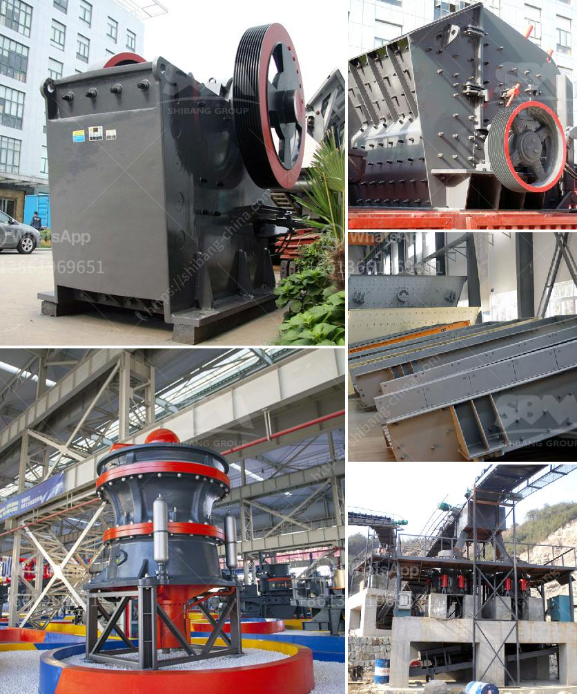

<h3>raymond mill price</h3>
Raymond mill is one of the essential equipment for non-metallic ore processing. With the continuous expansion of the application field of Raymond Mill, the demand for Raymond Mill in the market is also increasing. As a Raymond mill manufacturer, we have analyzed the market situation and summarized the factors affecting the Raymond mill price.

The first and most important factor is the brand awareness of the Raymond mill manufacturer. A well-known brand can not only guarantee the quality of the equipment but also provide comprehensive after-sales service and technical support. A good reputation can give consumers a sense of security, and they are more willing to choose products from reputable manufacturers. However, the price of Raymond Mill from well-known manufacturers is generally higher than that of some small and medium-sized manufacturers.

The second factor is the production cost of Raymond Mill. Raymond mill is a large-scale processing equipment with large power consumption and high labor costs. Manufacturers need to invest a lot of funds and manpower in the production process, which inevitably leads to an increase in the production cost of Raymond mill. If the equipment is of good quality and has advanced technology and materials, the production cost will be relatively higher, thus affecting the Raymond mill price.

The third factor is the market supply and demand situation. When the market demand for Raymond mill is high and the supply is relatively scarce, the price will naturally rise due to the imbalance in supply and demand. On the contrary, when the market supply exceeds demand, the competition between manufacturers becomes fierce, leading to a decrease in the Raymond mill price.

The fourth factor is the influence of raw material prices. The price of raw materials such as steel and iron, which are used to manufacture Raymond mill, will directly affect the equipment manufacturing cost. If the price of raw materials rises, it will increase the production cost for the manufacturers, leading to a rise in the Raymond mill price.

The last factor to consider is the equipment configuration and model. Raymond mill with different models and configurations has different prices. For example, the price of a Raymond mill with a larger output and higher configuration will be higher than that of a Raymond mill with a smaller output and lower configuration. Customers should choose the appropriate model and configuration according to their own needs and budget.

In conclusion, the price of Raymond mill is affected by a combination of factors such as brand awareness, production cost, market supply and demand, raw material prices, and equipment configuration. Customers should consider these factors comprehensively when purchasing Raymond mill, choose a reliable brand, and select the appropriate model and configuration according to their own needs and budget. By doing so, they can enjoy the benefits brought by high-quality Raymond mill and maximize their investment returns.
<h3>Contact us</h3><ul><li><strong>Whatsapp:&nbsp;<a href="https://wa.me/8613661969651">+8613661969651</a></strong></li><li><a href="https://swt.shibang-china.com/?git&amp;zhl&amp;raymond mill price"><strong>Online Service(chat now)</strong></a></li></ul><h3>Related</h3><ul><li><a href='france used conveyor belts for sale.md'>france used conveyor belts for sale</a></li><li><a href='quarry stone dressing machine.md'>quarry stone dressing machine</a></li><li><a href='grinding tools dealers in nigeria.md'>grinding tools dealers in nigeria</a></li><li><a href='coal screening process.md'>coal screening process</a></li><li><a href='raymond machine for sale.md'>raymond machine for sale</a></li></ul>