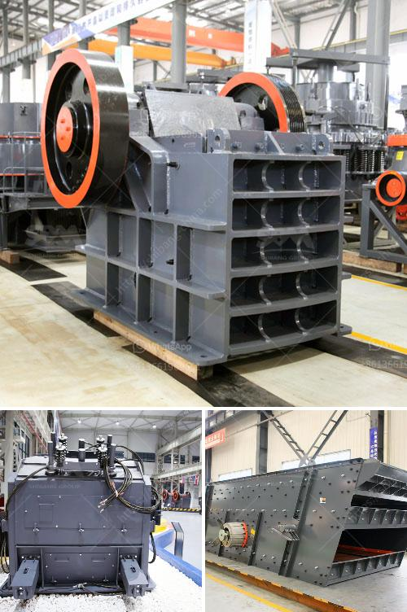

<h3>raymond mill roll asembley</h3>
Raymond mill is a common grinding equipment used in the field of mineral processing. It is suitable for grinding various non-flammable and explosive materials with Mohs hardness below 7 and humidity below 6%. In recent years, with the development of the grinding industry, Raymond mill has been continuously improved and optimized. One important component of Raymond mill is the roll assembly.

The roll assembly in a Raymond mill consists of roller, roller shaft, bearing, housing, spring support, and transmission device. The roller, also known as grinding roller, is an important component of Raymond mill. It is the core part of the grinding chamber and is responsible for material grinding. The roller shaft is the key transmission part of the roller, which ensures the normal operation of the roller. The bearing and housing support the roller assembly, providing stable operation and reducing friction. The spring support acts as shock absorption to ensure smooth operation of the Raymond mill. The transmission device drives the roller assembly to rotate and is responsible for transmitting power.

The roll assembly plays a crucial role in the performance of Raymond mill. First of all, the quality of the roller directly affects the grinding efficiency and output of Raymond mill. The roller should have good wear resistance and be able to withstand high pressure and impact. Therefore, it is usually made of high-quality alloy steel or manganese steel. The roller shaft should have sufficient strength and rigidity to ensure smooth rotation. The bearing should have good load-bearing capacity and be able to operate at high speeds. It is usually made of high-quality materials such as chrome steel. The housing should have good heat dissipation and sealing performance to prevent dust and moisture from entering the grinding chamber. The spring should have proper elasticity and damping effect to reduce vibration and noise. The transmission device should have stable and reliable operation to ensure the normal operation of the Raymond mill.

In order to ensure the high performance of Raymond mill, it is necessary to carry out regular maintenance and replacement of the roll assembly. Firstly, the roller, roller shaft, and bearing should be checked regularly for wear and damage. If any problems are found, they should be repaired or replaced in time. Secondly, the housing and spring should be cleaned regularly to remove dust and impurities. Thirdly, the transmission device should be inspected frequently to ensure smooth operation and lubrication. In addition, it is also necessary to add lubricating oil to the bearing and transmission parts regularly to reduce friction and extend the service life of the roll assembly.

In conclusion, the roll assembly is an important component of Raymond mill. It directly affects the grinding efficiency and output of Raymond mill. Therefore, it is necessary to pay attention to the maintenance and replacement of the roll assembly in order to ensure the high performance of Raymond mill and prolong its service life.
<h3>Contact us</h3><ul><li><strong>Whatsapp:&nbsp;<a href="https://wa.me/8613661969651">+8613661969651</a></strong></li><li><a href="https://swt.shibang-china.com/?git&amp;zhl&amp;raymond mill roll asembley"><strong>Online Service(chat now)</strong></a></li></ul><h3>Related</h3><ul><li><a href='chrome ore beneficiation plant in china.md'>chrome ore beneficiation plant in china</a></li><li><a href='basalt stone processing plant.md'>basalt stone processing plant</a></li><li><a href='conveyor belt supplier in riyadh.md'>conveyor belt supplier in riyadh</a></li><li><a href='vibrating screens australia.md'>vibrating screens australia</a></li><li><a href='canadia crusher portable chassis.md'>canadia crusher portable chassis</a></li></ul>