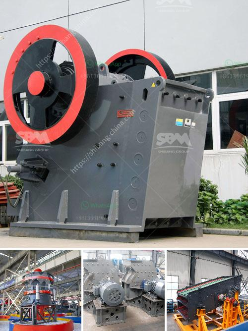

<h3>raymond mill technical specification</h3>
Raymond mill is one of the most commonly used grinding mills in the powder production line. It is mainly responsible for the grinding of various materials, such as limestone, marble, barite, dolomite, talc, activated carbon, etc.

Raymond mill has a wide range of applications, and its technical specification is very important. Customers should always consider the performance, durability, and efficiency of the machine before making a purchase. Here are some common technical specifications of Raymond mill:

1. Grinding roller and ring diameter: The grinding roller and ring diameter directly influences the grinding efficiency and fineness of the final product. Generally, a larger diameter ensures a higher grinding efficiency and finer output.

2. Input size: Raymond mill has a certain maximum feed size limit. It is advisable to choose a machine with a larger input size if the raw materials are relatively large.

3. Output size: The fineness of the final product is an important factor to consider. Raymond mill generally produces powders with a fineness range of 30-425 mesh. Customers can choose different models based on their specific requirements.

4. Capacity: Raymond mill's capacity is measured in tons per hour. Different models have different capacities, and customers should choose the appropriate model according to their production needs.

5. Main motor power: The power of the main motor directly affects the grinding efficiency and overall performance of the mill. Higher power ensures better productivity.

In conclusion, Raymond mill's technical specifications play a crucial role in determining its performance and suitability for specific applications. Customers should carefully analyze their production needs and consult with experts before making a purchase. It is advisable to choose a machine that meets the desired specifications to ensure optimal grinding efficiency and high-quality final products.
<h3>Contact us</h3><ul><li><strong>Whatsapp:&nbsp;<a href="https://wa.me/8613661969651">+8613661969651</a></strong></li><li><a href="https://swt.shibang-china.com/?git&amp;zhl&amp;raymond mill technical specification"><strong>Online Service(chat now)</strong></a></li></ul><h3>Related</h3><ul><li><a href='hammer mill 50 hr.md'>hammer mill 50 hr</a></li><li><a href='quarry and stone crushing executive business plan.md'>quarry and stone crushing executive business plan</a></li><li><a href='plant grinder mill price.md'>plant grinder mill price</a></li><li><a href='mobile crusher machine price.md'>mobile crusher machine price</a></li><li><a href='ball mill manufacturers in korea.md'>ball mill manufacturers in korea</a></li></ul>