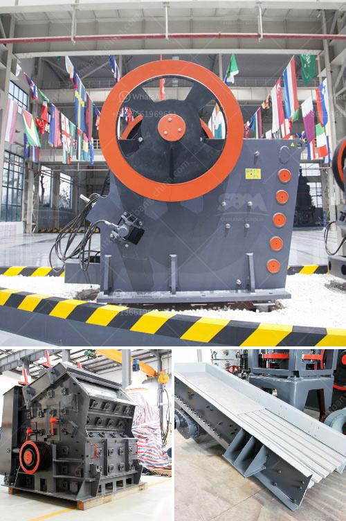

<h3>raymond roller mill model 30 picture</h3>
The Raymond roller mill, also known as the Raymond pulverizer, is one of the most widely used grinding mills in the United States. This versatile machine allows for the grinding and classification of a wide variety of materials including coal, cement, limestone, phosphate rock, bentonite, and clay. With its dependable performance, durability, and efficiency, the Raymond roller mill has become the standard in the milling industry.

The Raymond roller mill model 30 picture showcases the flexibility and reliability of this groundbreaking machine. It features an innovative design, allowing for automatic operation and precise control of the grinding process. The sophisticated control system ensures that the mill operates within the desired parameters, maintaining optimal grinding efficiency while reducing energy consumption.

The model 30 picture depicts a compact and robust machine designed for seamless integration into existing production lines. Its small footprint saves valuable floor space, making it an ideal choice for both large and small-scale operations. Additionally, the Raymond roller mill model 30 offers easy maintenance and reduced downtime, further enhancing its cost-effectiveness.

The picture provides a clear visualization of the main components of the Raymond roller mill. The grinding rollers, suspended on a balanced system, rotate around their axis, grinding the material between them and the stationary grinding ring. This unique design ensures a smooth and controlled grinding action, minimizing wear and tear on both the rollers and the grinding ring.

The mill's advanced air classification system is also highlighted in the picture. By controlling the airflow and the size of the particles, the Raymond roller mill can produce consistent and uniform product fineness. This ability to precisely control the particle size distribution is crucial in many industrial applications where the product's quality and performance are critical.

Another notable feature of the Raymond roller mill model 30 is its high capacity. The picture shows that the mill is capable of grinding large quantities of material in a single pass, making it well-suited for high-volume production environments. This efficiency translates into higher productivity and reduced operating costs, resulting in a significant return on investment for the users.

Overall, the Raymond roller mill model 30 picture demonstrates the machine's versatility, efficiency, and reliability. With its compact design, easy maintenance, and precise control of the grinding process, it has become a staple in various industries, from mining and minerals to construction materials. Whether it is reducing coal to fine powder or grinding limestone for cement production, the Raymond roller mill is a trusted and proven solution for many grinding applications.
<h3>Contact us</h3><ul><li><strong>Whatsapp:&nbsp;<a href="https://wa.me/8613661969651">+8613661969651</a></strong></li><li><a href="https://swt.shibang-china.com/?git&amp;zhl&amp;raymond roller mill model 30 picture"><strong>Online Service(chat now)</strong></a></li></ul><h3>Related</h3><ul><li><a href='stone crusher price in pakistan.md'>stone crusher price in pakistan</a></li><li><a href='mobile crusher equipment manufacturer.md'>mobile crusher equipment manufacturer</a></li><li><a href='impact crusher manufacturers in saudi.md'>impact crusher manufacturers in saudi</a></li><li><a href='stone crushers in bucaramanga.md'>stone crushers in bucaramanga</a></li><li><a href='china stone crusher pe 400 specs.md'>china stone crusher pe 400 specs</a></li></ul>