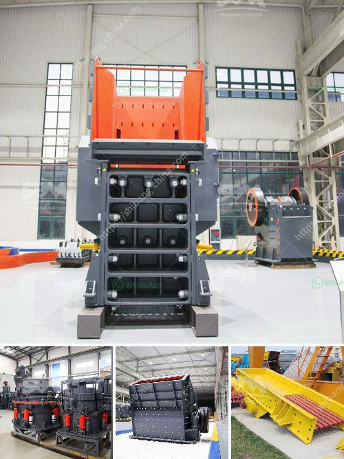

<h3>rent a conveyor belts singapur</h3>
When it comes to material handling, efficiency is key. Whether you are in the manufacturing, construction, or logistics industry, having a reliable and efficient method of transporting materials can greatly enhance productivity and reduce labor costs. That is where renting a conveyor belt in Singapore can make all the difference.

Conveyor belts are widely used in various industries for their ability to move heavy and bulky items from one point to another. In Singapore, there are companies that specialize in renting out conveyor belts to cater to the needs of businesses. This option provides an affordable and flexible solution for those who require a conveyor belt for a specific project or a temporary period.

One of the main advantages of renting a conveyor belt in Singapore is the cost savings it offers. Instead of investing a large sum of money in purchasing a conveyor belt, businesses can simply rent one for the duration they need. This not only eliminates the upfront costs but also eliminates the need for maintenance and storage expenses. Renting a conveyor belt allows businesses to allocate their resources more efficiently.

Furthermore, renting a conveyor belt in Singapore provides flexibility. Businesses can choose from a wide range of conveyor belt options based on their specific requirements. Whether it is a short-term rental for a specific project or a long-term contract, there are companies that offer various rental packages to suit different needs. This allows businesses to have access to the latest conveyor belt technology without the commitment of a purchase.

Another significant advantage of renting a conveyor belt in Singapore is the convenience it offers. The rental companies take care of the installation, maintenance, and breakdown services, ensuring that businesses can focus on their core operations. Furthermore, the rental companies have a team of experienced professionals who can provide guidance and support throughout the rental period.

In conclusion, renting a conveyor belt in Singapore can be a game-changer for businesses in terms of efficiency and cost savings. It offers a flexible and convenient solution for material handling needs, allowing businesses to focus on their core operations. With the option to choose from a variety of conveyor belt options, renting provides access to the latest technology without the heavy investment. So, consider renting a conveyor belt for your next project or material handling needs and experience the benefits firsthand.
<h3>Contact us</h3><ul><li><strong>Whatsapp:&nbsp;<a href="https://wa.me/8613661969651">+8613661969651</a></strong></li><li><a href="https://swt.shibang-china.com/?git&amp;zhl&amp;rent a conveyor belts singapur"><strong>Online Service(chat now)</strong></a></li></ul><h3>Related</h3><ul><li><a href='components of an impact mill.md'>components of an impact mill</a></li><li><a href='stone crusher machine from japan.md'>stone crusher machine from japan</a></li><li><a href='micro fine grinding machine.md'>micro fine grinding machine</a></li><li><a href='prices of stone crushers from nigeria.md'>prices of stone crushers from nigeria</a></li><li><a href='small rock crusher mining.md'>small rock crusher mining</a></li></ul>