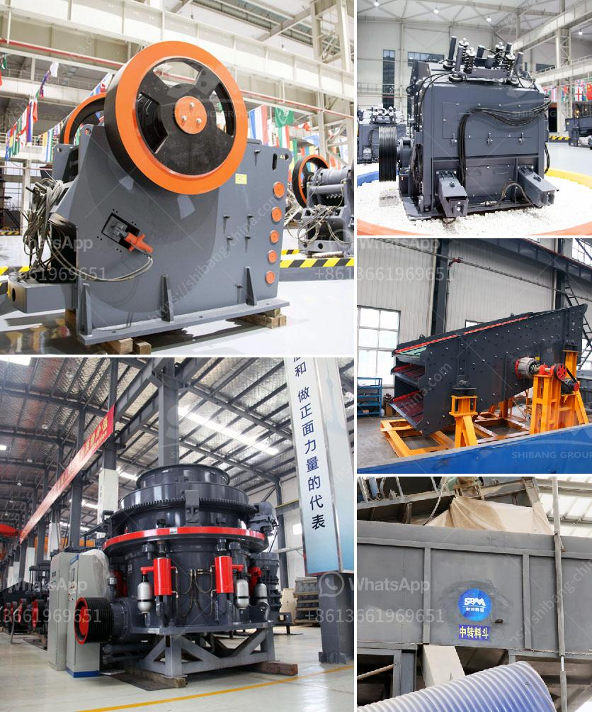

<h3>rent portable concrete crusher in los angeles</h3>
Renting a portable concrete crusher in Los Angeles is both cost-effective and convenient for construction projects. It provides an ideal solution as it eliminates the need for expensive transportation, and ensures that the concrete waste is recycled properly.

Los Angeles is a bustling city with a high demand for concrete, making it an ideal location to rent a portable concrete crusher. With landfill sites becoming increasingly rare and expensive, it is crucial to find a cost-effective and eco-friendly way to dispose of construction waste.

The process of renting a portable concrete crusher in Los Angeles is straightforward and hassle-free. Many companies offer portable concrete crushers for rent with different capacities and features. Some machines can crush up to 600 tons of concrete per hour, while others can handle smaller quantities.

Portable concrete crushers come with many benefits. One of the main advantages is that they can be easily transported to different job sites, even in remote locations. This eliminates the need for expensive transportation fees and allows you to tackle projects in various areas of Los Angeles.

Another benefit is the cost-effectiveness of renting a portable concrete crusher. Renting instead of buying a crusher allows you to free up capital for other essential expenses. It also eliminates the need for maintenance, storage, and other associated costs.

Furthermore, renting a portable concrete crusher in Los Angeles promotes sustainability. Concrete waste generated from construction projects is one of the largest contributors to landfill waste. By renting a portable concrete crusher, you can help reduce waste and help protect the environment. Concrete can be recycled and repurposed for future construction projects, reducing the need for new materials.

Renting a portable concrete crusher in Los Angeles is particularly useful for small to medium-sized construction projects. Whether you are building a new residential property, renovating an existing structure, or working on a commercial site, a portable concrete crusher rental offers a cost-effective solution. It allows you to break down and recycle concrete on-site, saving time and money on transportation and disposal fees.

When renting a portable concrete crusher, it is important to consider the specific needs of your project. The required capacity, features, and size of the crusher will depend on the type and volume of concrete you plan to crush. Additionally, it is crucial to rent from a reputable company that offers reliable equipment and excellent customer support.

To conclude, renting a portable concrete crusher in Los Angeles is an excellent option for any construction project. It provides a cost-effective and convenient way to crush and recycle concrete on-site, saving time, money, and the environment. Whether you are a contractor, homeowner, or business owner, renting a portable concrete crusher can help you efficiently manage your construction waste. So, why wait? Rent a portable concrete crusher in Los Angeles today and experience the benefits firsthand!
<h3>Contact us</h3><ul><li><strong>Whatsapp:&nbsp;<a href="https://wa.me/8613661969651">+8613661969651</a></strong></li><li><a href="https://swt.shibang-china.com/?git&amp;zhl&amp;rent portable concrete crusher in los angeles"><strong>Online Service(chat now)</strong></a></li></ul><h3>Related</h3><ul><li><a href='feldspar ball mill porcess.md'>feldspar ball mill porcess</a></li><li><a href='indonesia crushers of how much price.md'>indonesia crushers of how much price</a></li><li><a href='supplier for crusher.md'>supplier for crusher</a></li><li><a href='ball mill machine in pakistan.md'>ball mill machine in pakistan</a></li><li><a href='impact crusher equipment.md'>impact crusher equipment</a></li></ul>