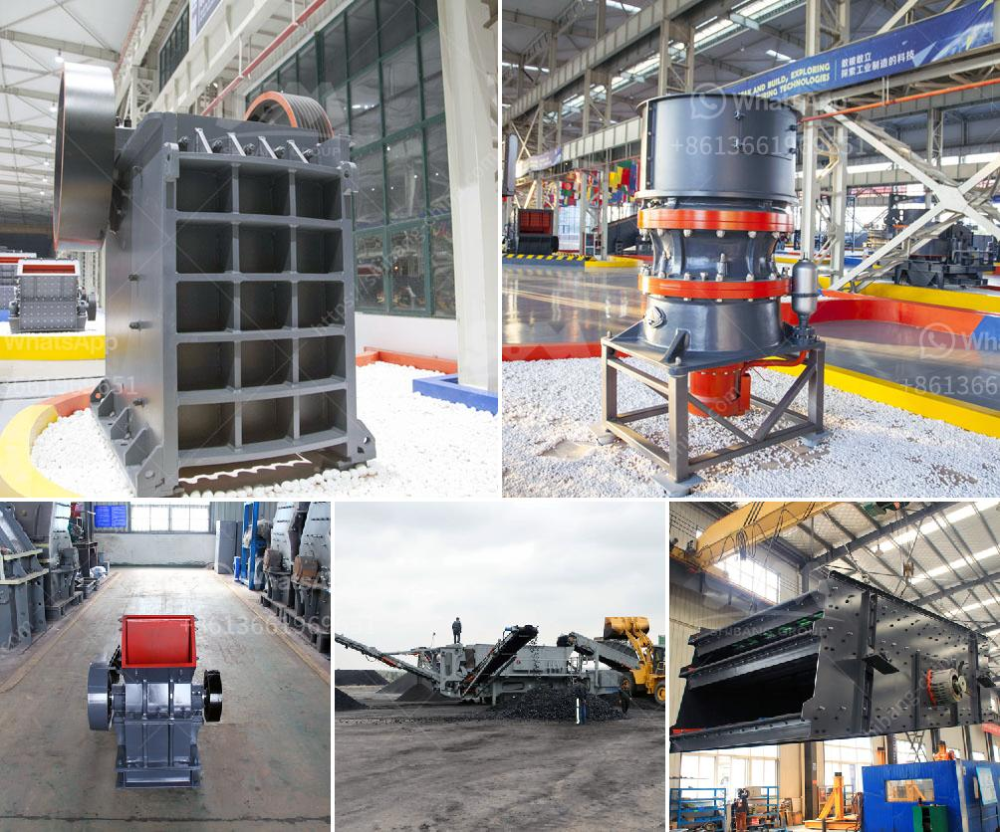

<h3>rock belt conveyor spec</h3>
In industrial settings, the transportation of heavy materials is a critical aspect of maintaining efficiency and productivity. Among the various equipment used for this purpose, rock belt conveyors have emerged as an indispensable tool. These conveyor systems play a crucial role in streamlining material handling processes, reducing manual labor, and increasing operational efficiency. In this article, we will explore the specifications and features of rock belt conveyors that make them an ideal choice for industries dealing with hefty materials.

One of the key elements that differentiates rock belt conveyors from other types is the durable and robust construction. These conveyors are designed to handle heavy loads and are often reinforced with high-strength materials, such as steel or reinforced rubber belts. The belt materials selected for rock belt conveyors come with excellent tensile strength and resistance to abrasion, ensuring longevity and reliability in harsh industrial environments.

Another important specification of rock belt conveyors is their adjustable inclination angle. These conveyors can be configured at different angles to suit the specific requirements of the material being transported. The adjustable inclination feature ensures efficient movement of rocks, stones, or other bulky items, preventing any potential slippage or spillage during the conveying process. This flexibility helps industries optimize their material handling operations and minimize disruptions.

Additionally, rock belt conveyors often come equipped with advanced safety features to ensure the well-being of operators and the protection of valuable equipment. Emergency stop buttons, overheat protection, and non-slip platforms are some of the safety measures incorporated into the design of these conveyors. Operators can work with peace of mind, knowing that the risk of accidents or equipment damage is significantly reduced.

In terms of versatility, rock belt conveyors excel at handling various types of materials. Not only can they transport rocks and stones, but they can also handle bulk materials such as gravel, sand, ores, and construction waste. This adaptability makes rock belt conveyors an invaluable asset for construction sites, mining operations, and other heavy-duty industries dealing with large volumes of materials.

Furthermore, modern rock belt conveyors are often customizable to meet specific operational requirements. They can be engineered with variable speeds, different belt widths, and additional features like load cells, which enable precise weighing during the conveying process. This customization ensures that the conveyor system seamlessly integrates into existing material handling setups while maximizing efficiency and accuracy.

In conclusion, rock belt conveyors with their robust construction, adjustable inclination, advanced safety features, and material versatility have revolutionized material handling in various industries. These conveyors provide a reliable and efficient solution for transporting heavy loads, significantly reducing manual labor and enhancing overall productivity. With their customizable features and ability to handle diverse materials, rock belt conveyors have become a fundamental component of modern industrial operations. Investing in a rock belt conveyor can have a profound impact on operational efficiency, reducing costs and increasing the throughput of materials.
<h3>Contact us</h3><ul><li><strong>Whatsapp:&nbsp;<a href="https://wa.me/8613661969651">+8613661969651</a></strong></li><li><a href="https://swt.shibang-china.com/?git&amp;zhl&amp;rock belt conveyor spec"><strong>Online Service(chat now)</strong></a></li></ul><h3>Related</h3><ul><li><a href='amenagement de station de concassage de 300 tonnes.md'>amenagement de station de concassage de 300 tonnes</a></li><li><a href='used carbon grinding production line.md'>used carbon grinding production line</a></li><li><a href='jaw crusher application.md'>jaw crusher application</a></li><li><a href='lime grinding machine manufacturer in kolhapur.md'>lime grinding machine manufacturer in kolhapur</a></li><li><a href='dubai dolomite crusher suppliers.md'>dubai dolomite crusher suppliers</a></li></ul>