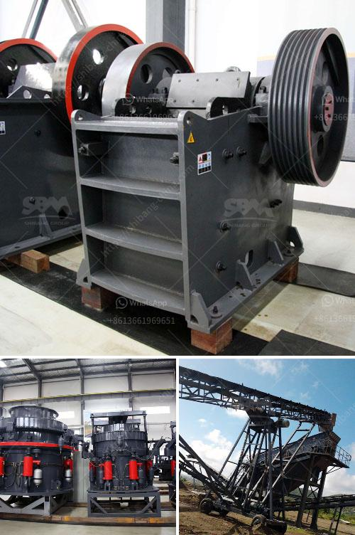

<h3>rock crusher cost</h3>
Rock crushers are used in various industries to crush rocks and minerals into smaller pieces. They help to reduce the size of large rock masses into a more manageable size, making them easier to transport and use. However, purchasing a rock crusher can be quite costly, which may deter many businesses and individuals from investing in one. In this article, we will discuss the cost of rock crushers and factors that can affect their prices.

The cost of a rock crusher can vary greatly depending on the size, features, and capabilities of the machine. Along with the brand, model, and supplier, these factors also contribute to the final price. On average, rock crushers cost between $100 and $500 per hour to operate. These costs include the cost of fuel, maintenance, repairs, and wear parts. However, the cost can increase significantly if the crusher requires frequent repairs or has a high consumption rate of fuel or wear parts.

The type of rock crusher also affects its cost. There are various types available in the market, including jaw crushers, impact crushers, cone crushers, and others. Each type has its own advantages and disadvantages, and the price can vary accordingly. For example, jaw crushers are generally more expensive than impact crushers, but they offer higher production rates and better control over the output size.

Another factor that affects the cost of a rock crusher is the size and capacity of the machine. Larger and more powerful rock crushers tend to be more expensive than smaller ones. This is because they require more material and stronger components to withstand the crushing process. Additionally, larger crushers are often equipped with advanced features and technologies, which contribute to their higher price.

Lastly, the geographical location and availability of rock crushers can also impact their cost. Areas with a higher demand for rock crushers may have higher prices due to increased competition. Similarly, regions with limited access to suppliers or transportation infrastructure may experience higher costs.

In conclusion, the cost of a rock crusher can vary depending on several factors. It is important to carefully consider the requirements and budget of your project before investing in a rock crusher. Comparison shopping, researching different suppliers, and negotiating for better prices can help reduce the overall cost. Moreover, regular maintenance and proper usage can help prolong the lifespan of the rock crusher, reducing repair and replacement costs in the long run.
<h3>Contact us</h3><ul><li><strong>Whatsapp:&nbsp;<a href="https://wa.me/8613661969651">+8613661969651</a></strong></li><li><a href="https://swt.shibang-china.com/?git&amp;zhl&amp;rock crusher cost"><strong>Online Service(chat now)</strong></a></li></ul><h3>Related</h3><ul><li><a href='turnkey project for gypsum board manufacturing plant.md'>turnkey project for gypsum board manufacturing plant</a></li><li><a href='100tpd cement plant project cost.md'>100tpd cement plant project cost</a></li><li><a href='gypsum board preparation process.md'>gypsum board preparation process</a></li><li><a href='rubble crushers for sale.md'>rubble crushers for sale</a></li><li><a href='second hand jaw crusher for sale in malaysia.md'>second hand jaw crusher for sale in malaysia</a></li></ul>