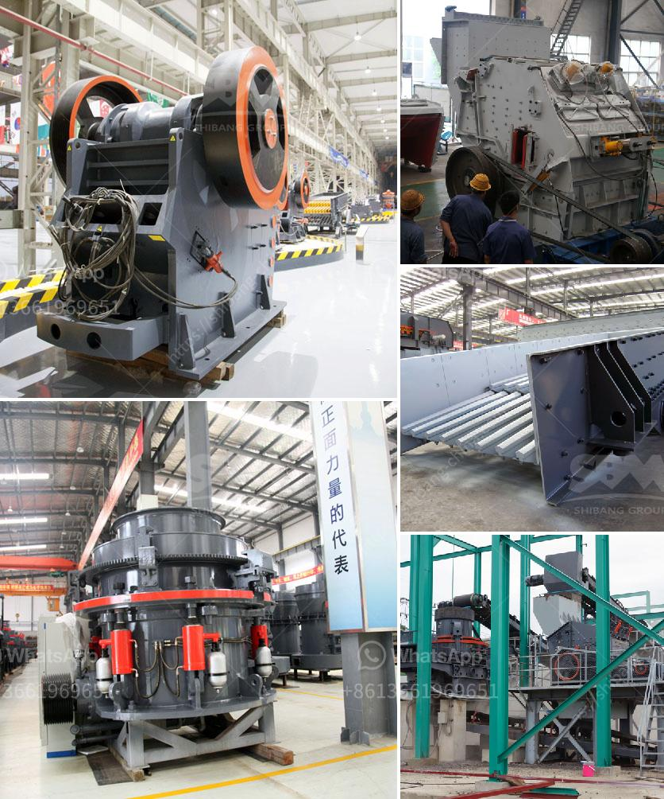

<h3>rock crusher for chromium or chromite ore</h3>
Chromium or chromite ore is primarily utilized in the production of ferrochrome, which is a key ingredient in the manufacturing of stainless steel. Chromite ore consists of a dark, reddish-black rock that is mined and processed to extract chromite, which contains chromium. One crucial step in the extraction process is comminution – the reduction of large chunks of ore into smaller pieces suitable for further processing. This is where rock crushers come into play.

A rock crusher is a device used to crush rocks into smaller pieces. It is commonly used in mining and construction industries for this purpose. The primary goal of a rock crusher is to break down large rocks into smaller pieces that can be used for concrete, asphalt, and various other construction applications. In the case of chromite ore, rock crushers are typically employed during the mining and processing of the ore to generate fine particles.

There are various types of rock crushers available in the market, each offering unique benefits and capabilities. Some of the commonly used rock crushers for chromite ore include jaw crushers, cone crushers, impact crushers, and hammer crushers.

Jaw crushers are designed to handle large rocks and are commonly used in primary crushing operations. Their robust design and high crushing capacity make them ideal for breaking down chromite ore into smaller particles. Due to their simplicity and ease of operation, jaw crushers are widely used in the mining industry.

Cone crushers, on the other hand, are mostly used for secondary and tertiary crushing processes. They are capable of producing finer particles compared to jaw crushers. Cone crushers excel at producing high-quality end products with uniform particle sizes, making them suitable for chromite ore processing.

Impact crushers are versatile machines that can handle a variety of materials, including chromite ore. They utilize a high-speed rotor with blow bars to impact the material and produce smaller particles. Impact crushers are commonly used in mining and recycling applications, providing efficient and precise crushing.

Hammer crushers, also known as hammer mills, are primarily used for crushing brittle materials such as chromite ore. They employ a series of rotating hammers to impact and shatter the ore into smaller particles. Hammer crushers are often used in mining and cement industries for reducing clinker and raw materials.

Choosing the right rock crusher for chromite ore requires considering various factors such as the desired product size, capacity, and operational costs. It is crucial to consult with experts and manufacturers to select the most suitable rock crusher for specific ore processing needs.

In conclusion, rock crushers play a vital role in the mining and processing of chromite ore by reducing large chunks of ore into smaller particles. The different types of rock crushers available offer diverse benefits and capabilities, allowing for efficient and precise crushing. Proper selection and utilization of rock crushers contribute to improved productivity and cost efficiency in chromite ore processing operations.
<h3>Contact us</h3><ul><li><strong>Whatsapp:&nbsp;<a href="https://wa.me/8613661969651">+8613661969651</a></strong></li><li><a href="https://swt.shibang-china.com/?git&amp;zhl&amp;rock crusher for chromium or chromite ore"><strong>Online Service(chat now)</strong></a></li></ul><h3>Related</h3><ul><li><a href='ball mill machinery supplier manufacturer.md'>ball mill machinery supplier manufacturer</a></li><li><a href='crusher vsi machine in bangalore.md'>crusher vsi machine in bangalore</a></li><li><a href='black granite land for sale in tamilnadu.md'>black granite land for sale in tamilnadu</a></li><li><a href='second hand ball mill for sale in philippines.md'>second hand ball mill for sale in philippines</a></li><li><a href='coal crusher machine in zhengzhou henan china.md'>coal crusher machine in zhengzhou henan china</a></li></ul>