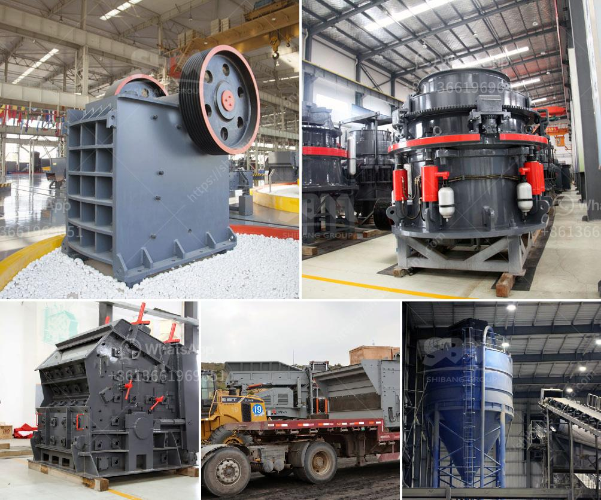

<h3>rock crusher for crushing balsalt stone</h3>
Basalt is a very common igneous rock. It is the most common rock in the Earth's crust. Almost all oceanic crust is made of basalt and basalt is a common extrusion from many volcanic regions around the world. Basalt Stone Crushing Process:

Big basalt materials are fed to the jaw crusher evenly and gradually by vibrating feeder through a hopper for primary crushing. After first crushing, the basalt stone will be fed into cone crusher by belt conveyor for secondary crushing; then the crushed basalt materials will be transported to vibrating screen for separating.

While designing a complete quarry crusher plant, raw material is the first factor we should take into consideration, because the specification of raw material decides the working efficiency of the complete quarry crusher plant. To some extent, the small size of the rock will reduce the quality of the finished product, so put forward reasonable suggestions in terms of equipment selection is an important issue to be considered in the crushing plant. The commonly used equipment in a stone crushing plant includes jaw crusher, impact crusher, vertical shaft impact crusher and vibrating screen.

The machines are connected with belt conveyor. Setting up a traditional stone crushing plant needs high investment, long time and the site is fixed. Mobile Construction Station

Mobile crushing station, which can also be called mobile crusher or mobile quarrying plant, is a new type of crushing plant. Some crushing machines and screening machines can be installed onto the movable platform of the mobile construction station, which greatly improves the flexibility of the equipment. In the areas where fixed production line is not convenient to set up, using mobile crushing station will be very convenient. For example, when processing construction waste, mobile crusher can be placed in one place, and after finishing the crushing task, it can be removed to another place immediately.

For basalt stone crushing, you can choose jaw crusher, which is the most common primary crushing machine in the quarry. It has high crushing ratio and can crush the high hardness basalt stones into small size. Meanwhile, cone crusher, which is best for medium crushing, can crush the basalt stones which have fine output granularity, transforming them to sand. So to stone crushing process, while designing a complete basalt crushing plant, the rationality of the combination of these two devices should still be taken into consideration.

In recent years, with the continuous development of China's infrastructure industry, it is expected that the demand for sand and gravel aggregates will continue to rise in the future for building houses, highways, railways, and other infrastructure projects. And basalt, as a common rock resource, plays a vital role in this infrastructure construction. Therefore, the primary task for basalt processing enterprises is to select suitable techniques and equipment for crushing, sand making and shaping processes. In this process, jaw crusher and cone crusher play an essential role. For the complete basalt crushing plant, the most often used equipment are jaw crusher, cone crusher, impact crusher, VSI impact crusher. As the world's leading manufacturer of mining equipment, SBM can provide equipment and the complete basalt crushing plant to produce basalt particles for building construction.
<h3>Contact us</h3><ul><li><strong>Whatsapp:&nbsp;<a href="https://wa.me/8613661969651">+8613661969651</a></strong></li><li><a href="https://swt.shibang-china.com/?git&amp;zhl&amp;rock crusher for crushing balsalt stone"><strong>Online Service(chat now)</strong></a></li></ul><h3>Related</h3><ul><li><a href='hammer mill how it works.md'>hammer mill how it works</a></li><li><a href='small scale coal processing plant.md'>small scale coal processing plant</a></li><li><a href='brick making machine for sale in south africa.md'>brick making machine for sale in south africa</a></li><li><a href='jual grinding roll mill.md'>jual grinding roll mill</a></li><li><a href='100tph vibratory feeder.md'>100tph vibratory feeder</a></li></ul>