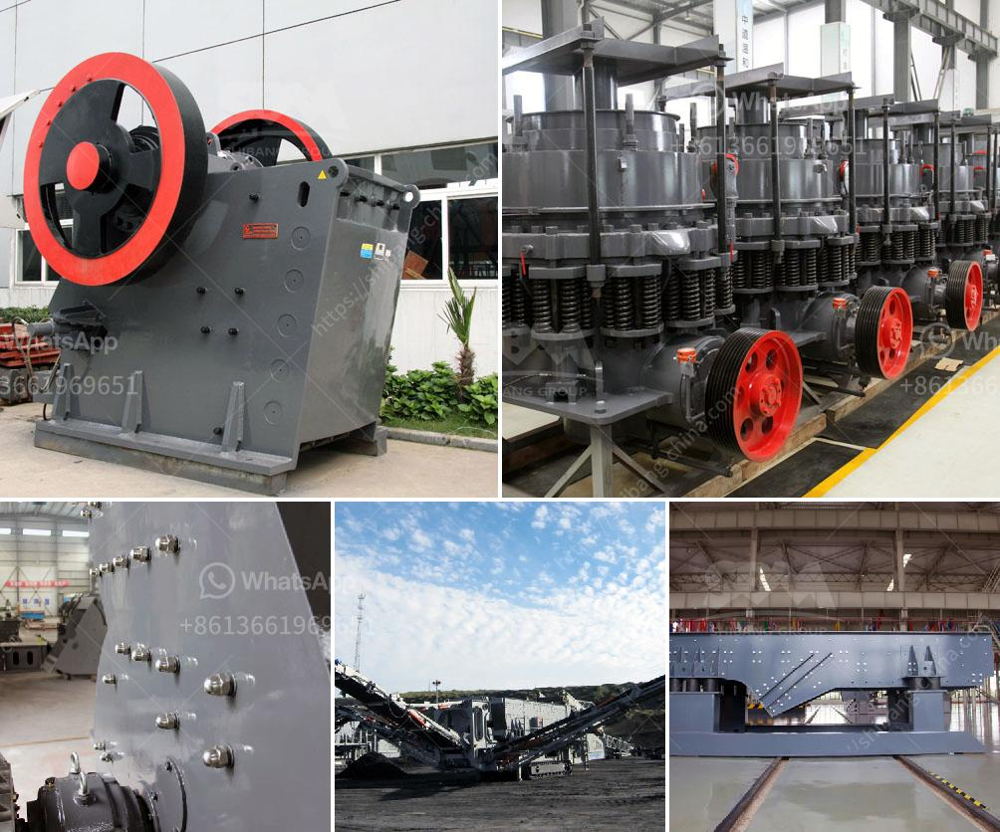

<h3>rock crusher machine manufacturer</h3>
A rock crusher is a machine used to crush rocks into smaller pieces, usually for gravel or some other road or building application. Most rock crushers have a hopper at the top - a container which holds the rock above the crusher and uses gravity to feed it in. Alternately, rock crushers can use a belt drive to continuously transport the rock into the crusher.

At the heart of every rock crushing machine is a crusher that is designed to reduce large rocks into smaller pieces. These machines are built using heavy-duty construction equipment, such as rock crushers, which are robust machinery designed to withstand the intense wear and tear of continuous operation.

When looking for a rock crusher machine manufacturer, customers should look for a company that specializes in designing and manufacturing high-quality rock crushers. These machines are important pieces of equipment that can significantly boost the productivity of construction, mining, and material handling operations.

One of the key features to look for in a rock crusher machine manufacturer is their ability to customize the machine to meet specific customer requirements. Different applications may require different types of crushers, such as jaw crushers, impact crushers, or cone crushers. A reliable manufacturer should be able to provide a range of options to suit these requirements.

Additionally, a reputable rock crusher machine manufacturer should offer comprehensive after-sales service and support. This includes technical support, spare parts availability, and on-site maintenance and repair services. These services are critical to ensure minimal downtime and maximum productivity for customers.

Choosing a rock crusher machine manufacturer is an important decision that can impact the overall success of a project. By selecting a manufacturer that provides high-quality machines, customization options, and comprehensive after-sales support, customers can ensure they get the most out of their rock crushing equipment.
<h3>Contact us</h3><ul><li><strong>Whatsapp:&nbsp;<a href="https://wa.me/8613661969651">+8613661969651</a></strong></li><li><a href="https://swt.shibang-china.com/?git&amp;zhl&amp;rock crusher machine manufacturer"><strong>Online Service(chat now)</strong></a></li></ul><h3>Related</h3><ul><li><a href='total cost of machinery of stone crusher.md'>total cost of machinery of stone crusher</a></li><li><a href='used stone crushers for sale from uae.md'>used stone crushers for sale from uae</a></li><li><a href='jaw crusher construction.md'>jaw crusher construction</a></li><li><a href='high crushing ratio low cost jaw crusher machine.md'>high crushing ratio low cost jaw crusher machine</a></li><li><a href='business plan for a cement plant.md'>business plan for a cement plant</a></li></ul>