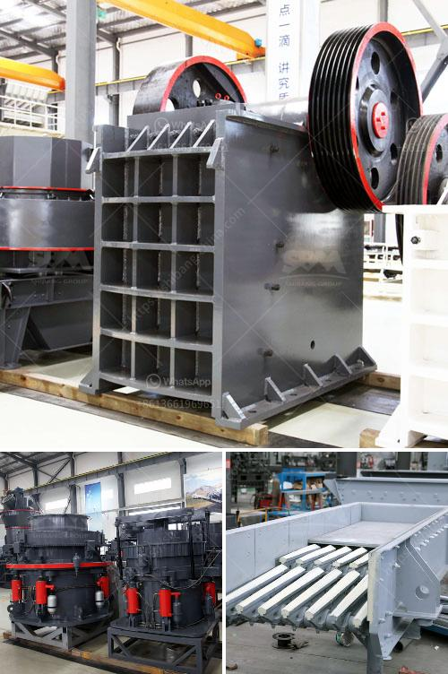

<h3>rock crusher pulverizer</h3>
A rock crusher pulverizer is a machine that reduces the size of a rock or ore by crushing it into small fragments. It is used to crush larger rocks into smaller pieces for subsequent processing, such as extracting valuable minerals or preparing them for further refining. The pulverizer is an essential tool in the mining industry as it allows for efficient and fast crushing of materials.

The rock crusher pulverizer works by forcefully throwing the rocks against a plate or hammer. These stones are continuously subjected to the impacting force, which causes them to break and reduce in size. The pulverizer is usually powered by an electric motor, providing the necessary power to break the rocks.

One of the main advantages of using a rock crusher pulverizer is its ease of use and maintenance. The machine is designed to be simple and straightforward, allowing workers to operate it with minimal training. Additionally, the pulverizer is built to withstand tough working conditions, making it highly reliable and durable.

Another advantage of using a rock crusher pulverizer is its ability to process a wide range of materials. It can crush both soft and hard rocks, including ores, limestone, granite, and coal. This versatility allows for various applications in different industries, such as mining, construction, and recycling.

Furthermore, a rock crusher pulverizer provides a cost-effective solution for crushing large quantities of rocks. By reducing the size of the rocks into smaller particles, it enables efficient transportation and storage. Additionally, smaller fragments are easier to handle and process, resulting in increased productivity and reduced costs.

In conclusion, a rock crusher pulverizer is a valuable asset in the mining industry. Its ability to crush rocks into smaller fragments efficiently and effectively provides many advantages, including ease of use, maintenance, and versatility. It plays a crucial role in processing rocks and ores for further refining or extraction of valuable minerals. Whether in mining or construction, a rock crusher pulverizer is a reliable tool for enhancing productivity and reducing costs.
<h3>Contact us</h3><ul><li><strong>Whatsapp:&nbsp;<a href="https://wa.me/8613661969651">+8613661969651</a></strong></li><li><a href="https://swt.shibang-china.com/?git&amp;zhl&amp;rock crusher pulverizer"><strong>Online Service(chat now)</strong></a></li></ul><h3>Related</h3><ul><li><a href='kaolin stone crusher.md'>kaolin stone crusher</a></li><li><a href='raymond mill manufactrer in udaipur.md'>raymond mill manufactrer in udaipur</a></li><li><a href='dolomite mining and processing.md'>dolomite mining and processing</a></li><li><a href='specification for stone crushing for roads.md'>specification for stone crushing for roads</a></li><li><a href='mobile stone crusher price in india.md'>mobile stone crusher price in india</a></li></ul>