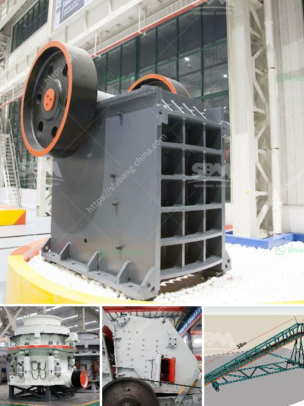

<h3>rock crushers for sale ghana</h3>
Rock crushers are a vital part of any construction site or mining operation. They break down larger rocks into smaller pieces, making it easier to transport and crush them for further processing. But finding high-quality rock crushers for sale in Ghana can be a challenge.

Ghana is known for its rich mineral resources, with gold being the most important. But the country also has deposits of various other minerals like bauxite, manganese, and iron ore. This makes it an ideal location for mining companies to operate and extract these valuable resources.

To ensure efficient mining operations, rock crushers are necessary equipment. They are used to crush and grind rocks into smaller sizes, making it easier to extract the desired minerals. Rock crushers come in different sizes and configurations, depending on the specific needs of the operation.

When looking for rock crushers for sale in Ghana, it is important to consider various factors. Firstly, determine the specific requirements of the operation. This includes the size and type of rocks to be crushed, the desired output size, and the expected capacity. Having a clear understanding of these requirements will help in choosing the most suitable rock crusher.

Another important consideration is the quality and reliability of the rock crusher. It is crucial to invest in a high-quality machine that can withstand the harsh conditions of a mining operation. Look for rock crushers made with durable materials and reliable components that can handle heavy-duty tasks.

Additionally, it is essential to buy from reputable and trusted suppliers. They should have a proven track record of delivering high-quality rock crushers and providing excellent after-sales service and support. Look for customer reviews and testimonials to gauge the reputation and reliability of the supplier.

In conclusion, rock crushers are indispensable equipment for mining operations in Ghana. They play a crucial role in breaking down rocks into smaller pieces for further processing. When looking for rock crushers for sale, consider factors like specific requirements, quality, reliability, and the reputation of the supplier. By investing in the right rock crusher, mining companies can enhance their operational efficiency and maximize their productivity.
<h3>Contact us</h3><ul><li><strong>Whatsapp:&nbsp;<a href="https://wa.me/8613661969651">+8613661969651</a></strong></li><li><a href="https://swt.shibang-china.com/?git&amp;zhl&amp;rock crushers for sale ghana"><strong>Online Service(chat now)</strong></a></li></ul><h3>Related</h3><ul><li><a href='100tph coal crushing process.md'>100tph coal crushing process</a></li><li><a href='start up granite quarry crusher business.md'>start up granite quarry crusher business</a></li><li><a href='silica sand mine owners in pakistan.md'>silica sand mine owners in pakistan</a></li><li><a href='raymond machine for sale.md'>raymond machine for sale</a></li><li><a href='china crusher contact australia.md'>china crusher contact australia</a></li></ul>