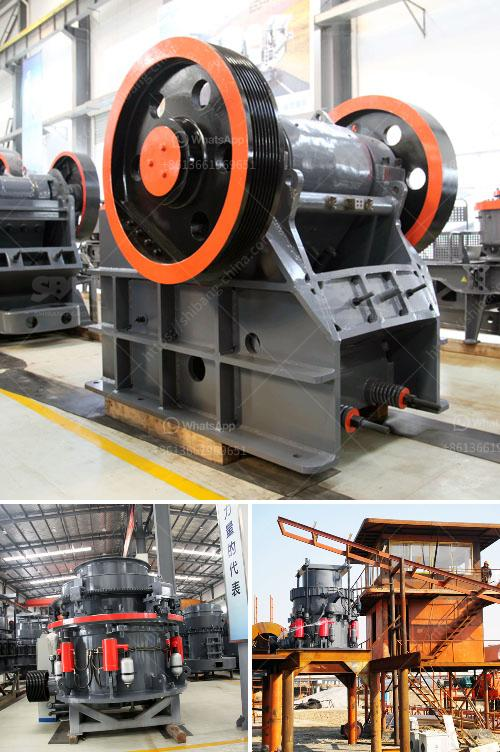

<h3>rock crushers under 50 tonne per hour</h3>
Rock crushers are essential equipment in mining, quarrying, and construction industries. These crushers are used to break down large stones into smaller pieces, making them easier to transport and use. One important factor to consider when buying a rock crusher is its capacity, which is measured in tonnes per hour. In this article, we will focus on rock crushers under 50 tonnes per hour.

When it comes to small-scale crushing operations, rock crushers that can process 50 tonnes of material per hour or less are commonly used. These machines are versatile and can handle various types of materials, such as limestone, granite, or basalt. They are also compact and lightweight, making them suitable for transportation to multiple job sites.

One of the main advantages of rock crushers with a capacity under 50 tonnes per hour is their affordability and accessibility. These crushing machines are relatively affordable, especially when compared to larger crushers that can process hundreds of tonnes per hour. Therefore, smaller operations or businesses with limited budgets can easily acquire these crushers without breaking the bank.

Additionally, these smaller rock crushers are readily available in the market. Numerous manufacturers produce crushers with a capacity under 50 tonnes per hour, providing buyers with a wide range of options to choose from. This competition in the market ensures that buyers can find the best crusher that suits their specific needs, both in terms of price and features.

Despite their lower capacity, rock crushers under 50 tonnes per hour can still effectively process a substantial amount of material. For small-scale projects or niche applications, such as road construction, they can be the perfect solution. The reduced capacity of these rock crushers decreases the production time, allowing operators to keep up with their project schedules efficiently.

Furthermore, their compact size and lower weight make these crushers highly portable and easy to transport from one location to another. This portability allows operators to move the crusher closer to the material source, minimizing transportation costs and improving efficiency. It also enables the crusher to be easily set up on different job sites, reducing downtime and increasing productivity.

In conclusion, rock crushers under 50 tonnes per hour have emerged as a viable option for small-scale crushing operations. Their affordability, availability, and portability make them attractive to businesses with limited budget and resources. While they may have lower production capacities compared to larger crushers, they can still efficiently process a considerable amount of material. Whether it's a mining, quarrying, or construction project, these rock crushers are an ideal choice for any small-scale operation.
<h3>Contact us</h3><ul><li><strong>Whatsapp:&nbsp;<a href="https://wa.me/8613661969651">+8613661969651</a></strong></li><li><a href="https://swt.shibang-china.com/?git&amp;zhl&amp;rock crushers under 50 tonne per hour"><strong>Online Service(chat now)</strong></a></li></ul><h3>Related</h3><ul><li><a href='dolomite rock processing plan in ethiopia.md'>dolomite rock processing plan in ethiopia</a></li><li><a href='small scale gold cip processing.md'>small scale gold cip processing</a></li><li><a href='jaw crusher size and capacity.md'>jaw crusher size and capacity</a></li><li><a href='concrete cube crushing machine price.md'>concrete cube crushing machine price</a></li><li><a href='raymond 5 roller mill.md'>raymond 5 roller mill</a></li></ul>